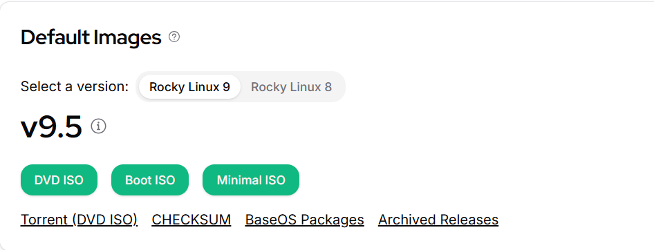
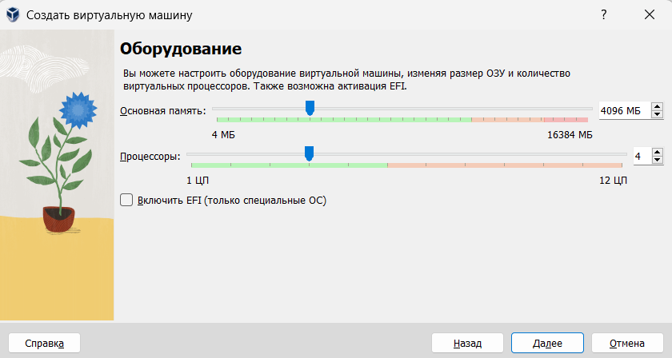
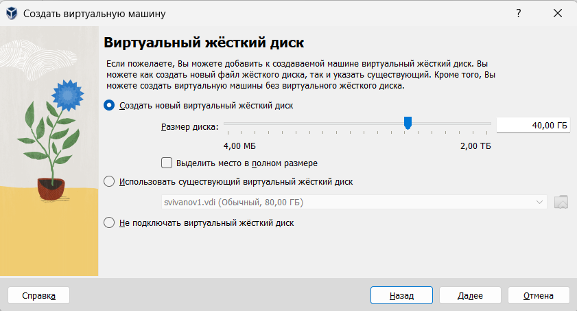
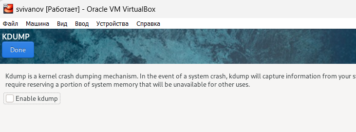
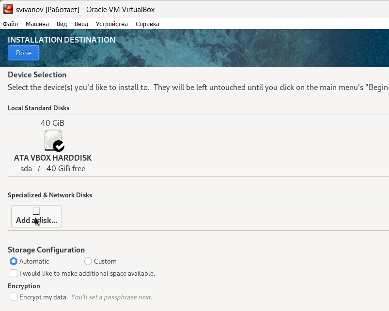
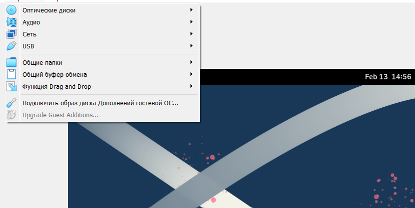
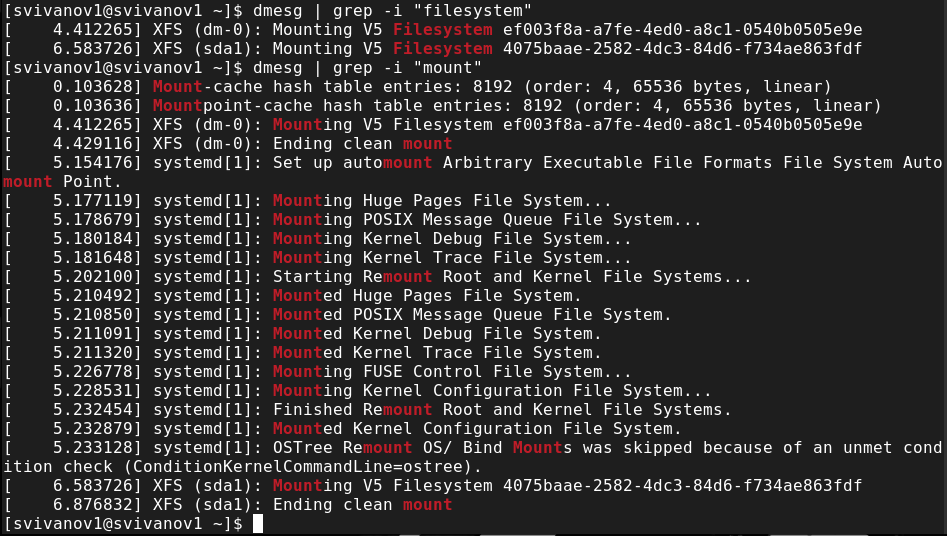

---
## Front matter
lang: ru-RU
title: Лабораторная работа №1
subtitle: Основы информационной безопасности
author:
  - Иванов Сергей Владимирович, НПИбд-01-23
institute:
  - Российский университет дружбы народов, Москва, Россия
date: 15 февраля 2024

## i18n babel
babel-lang: russian
babel-otherlangs: english

## Formatting pdf
toc: false
slide_level: 2
aspectratio: 169
section-titles: true
theme: metropolis
header-includes:
 - \metroset{progressbar=frametitle,sectionpage=progressbar,numbering=fraction}
 - '\makeatletter'
 - '\beamer@ignorenonframefalse'
 - '\makeatother'

 ## Fonts
mainfont: PT Serif
romanfont: PT Serif
sansfont: PT Sans
monofont: PT Mono
mainfontoptions: Ligatures=TeX
romanfontoptions: Ligatures=TeX
sansfontoptions: Ligatures=TeX,Scale=MatchLowercase
monofontoptions: Scale=MatchLowercase,Scale=0.9
---

## Цель работы

Целью данной работы является приобретение практических навыков установки операционной системы на виртуальную машину, настройки минимально необходимых для дальнейшей работы сервисов.

## Задание

1. Создать виртуальную машину
2. Установить ОС на виртуальную машину
3. Настроить систему

# Выполнение работы

## Скачиваем дистрибутив

Необходимо скачать дистрибутив Rocky
https://rockylinux.org/download

{#fig:001 width=70%}

## Создание виртуальной машины

Укажем имя машины и подключим наш скачанный образ Rocky. 

{#fig:002 width=70%}

## Создание виртуальной машины

Укажем объём памяти и количество виртуальных процессоров. Я указал 4096 мб оперативной памяти и 4 ЦП. Далее укажем обьем диска 40гб. 

{#fig:003 width=70%}

## Виртуальный жесткий диск

Далее укажем обьем диска 40гб.

{#fig:004 width=70%}

## Запуск виртуальной машины

Запускаем виртуальную машину.

{#fig:005 width=70%}

## Выбор языка интерфейса

Выбираем английский язык интерфейса.

{#fig:006 width=70%}

## Выбор программ

Выбираем необходимые программы.

{#fig:007 width=70%}

## Отключение KDUMP

Далее нам необходимо отключить KDUMP

{#fig:008 width=70%}

## Место установки

Выбираем место установки

{#fig:009 width=70%}

## Сеть и имя узла

Включим сетевое соединение и укажем имя узла 

{#fig:010 width=70%}

## Установка пароля для root

Установим пароль для root

{#fig:011 width=70%}

## Задаем пользователя

Задаем локального пользователя

{#fig:012 width=70%}

## Окно настройки установки образа

Нажмимаю на Begin Installation для начала установки.

{#fig:013 width=70%}

## Завершение установки ОС

После завершения установки перезапускаю систему

{#fig:014 width=70%}

## Дополнения гостевой ОС

Подключаю образ диска дополнений гостевой ОС.

{#fig:015 width=70%}

## Дополнения гостевой ОС

Запускаю образ диска дополнений гостевой ОС.

{#fig:016 width=70%}

# Домашнее задание

## Версия ядра Linux (Linux version).

Чтобы посмотреть версию ядра, можно воспользоваться командой dmesg | grep -i ‘linux version’. 
Версия ядра: 5.14.0-427.

{#fig:017 width=70%}

## Частота процессора (Detected Mhz processor).

Частоту процессора можно узнать командой dmesg | grep -I “MHz”.
Частота процессора: 2688.004 MHz.

{#fig:018 width=70%}

## Модель процессора (CPU0).

Модель процессора можно посмотреть командой cat /proc/cpuinfo | grep “model name”.

{#fig:019 width=70%}

## Объем доступной оперативной памяти (Memory available).

Объём доступной оперативной памяти можно посмотреть командой free -m.
В моём случае: 
Всего – 3915 Мб.
Используется – 1450 Мб.
Свободно – 830 Мб.

{#fig:020 width=70%}

## Тип обнаруженного гипервизора (Hypervisor detected).

Тип обнаруженного гипервизора можно посмотреть командой dmesg | grep -I “hypervisor detected”.
В моём случае: KVM.

{#fig:021 width=70%}

## Тип файловой системы корневого раздела.

Тип файловой системы корневого раздела можно посмотреть командой dmesg | grep -I “filesystem”

{#fig:022 width=70%}

## Последовательность монтирования файловых систем.

Последовательность монтирования файловых систем можно посмотреть командой dmesg | grep -i “mount”

{#fig:023 width=70%}

# Вывод

## Вывод 

В ходе работы были приобретены практические навыки установки виртуальной машины и операционной системы на виртуальную машину, а также настройки минимально необходимых для дальнейшей работы сервисов.

## Список литературы{.unnumbered}

::: {#refs}
1. Dash, P. Getting Started with Oracle VM VirtualBox / P. Dash. – Packt Publishing Ltd, 2013. – 86 сс.
2. Colvin, H. VirtualBox: An Ultimate Guide Book on Virtualization with VirtualBox. VirtualBox / H. Colvin. – CreateSpace Independent Publishing Platform, 2015. – 70 сс.
3. Vugt, S. van. Red Hat RHCSA/RHCE 7 cert guide : Red Hat Enterprise Linux 7 (EX200 and EX300) : Certification Guide. Red Hat RHCSA/RHCE 7 cert guide / S. van Vugt. – Pearson IT Certification, 2016. – 1008 сс.
4. Робачевский, А. Операционная система UNIX / А. Робачевский, С. Немнюгин, О. Стесик. – 2-е изд. – Санкт-Петербург : БХВ-Петербург, 2010. – 656 сс.
5. Немет, Э. Unix и Linux: руководство системного администратора. Unix и Linux / Э. Немет, Г. Снайдер, Т.Р. Хейн, Б. Уэйли. – 4-е изд. – Вильямс, 2014. – 1312 сс.
6. Колисниченко, Д.Н. Самоучитель системного администратора Linux : Системный администратор / Д.Н. Колисниченко. – Санкт-Петербург : БХВ-Петербург, 2011. – 544 сс.
7. Robbins, A. Bash Pocket Reference / A. Robbins. – O’Reilly Media, 2016. – 156 сс.

:::

 
