---
## Front matter
lang: ru-RU
title: Лабораторная работа №2
subtitle: Основы информационной безопасности
author:
  - Иванов Сергей Владимирович, НПИбд-01-23
institute:
  - Российский университет дружбы народов, Москва, Россия
date: 28 февраля 2024

## i18n babel
babel-lang: russian
babel-otherlangs: english

## Formatting pdf
toc: false
slide_level: 2
aspectratio: 169
section-titles: true
theme: metropolis
header-includes:
 - \metroset{progressbar=frametitle,sectionpage=progressbar,numbering=fraction}
 - '\makeatletter'
 - '\beamer@ignorenonframefalse'
 - '\makeatother'

 ## Fonts
mainfont: PT Serif
romanfont: PT Serif
sansfont: PT Sans
monofont: PT Mono
mainfontoptions: Ligatures=TeX
romanfontoptions: Ligatures=TeX
sansfontoptions: Ligatures=TeX,Scale=MatchLowercase
monofontoptions: Scale=MatchLowercase,Scale=0.9
---

## Цель работы

Получение практических навыков работы в консоли с атрибутами файлов, закрепление теоретических основ дискреционного разграничения доступа в современных системах с открытым кодом на базе ОС Linux.

## Задание

1. Заполнить таблицу «Установленные права и разрешённые действия»
2. Заполнить таблицу «Минимальные права для совершения операций»

# Выполнение работы

## Создание guest

Создаем учётную запись пользователя guest:
useradd guest
Задаю пароль для пользователя guest (рис. 1) :
passwd guest

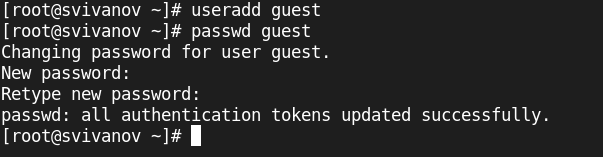{#fig:001 width=70%}

## Вход от guest

Входим в систему от имени пользователя guest. (рис. 2).

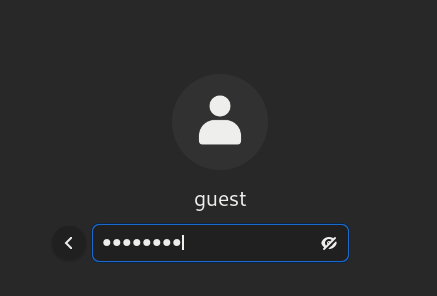{#fig:002 width=70%}

## Опаределяем домашнюю директорию

Определим директорию, в которой мы находимся, командой pwd. Она является домашней. (рис. 3).

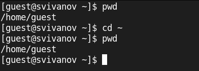{#fig:003 width=70%}

## Имя пользователя

Уточним имя пользователя командой whoami. (рис. 4).

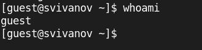{#fig:004 width=70%}

## Вывод команды id

Уточним имя пользователя, его группу, а также группы, куда входит пользователь, командой id и groups. (рис. 5). 

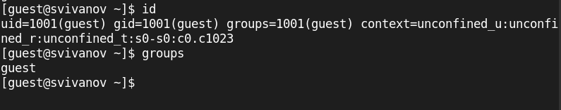{#fig:005 width=70%}

## Файл /etc/passwd

Просмотрим файл /etc/passwd командой
cat /etc/passwd (рис. 6). 

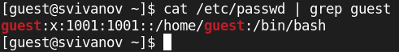{#fig:006 width=70%}

## Просмотр директорий

Определите существующие в системе директории командой
ls -l /home/ 
Не удалось получить список поддиректорий директории /home. (рис. 7). 

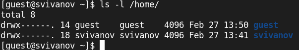{#fig:007 width=70%}

## Просмотр расширенных атрибутов

Проверим, какие расширенные атрибуты установлены на поддиректориях, находящихся в директории /home, командой:
lsattr /home. (рис. 8).

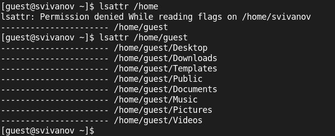{#fig:008 width=70%}

## Определение прав доступа

Создадим в домашней директории поддиректорию dir1 командой
mkdir dir1
Определим командами ls -l и lsattr, какие права доступа и расширенные атрибуты были выставлены на директорию dir1. (рис. 9).

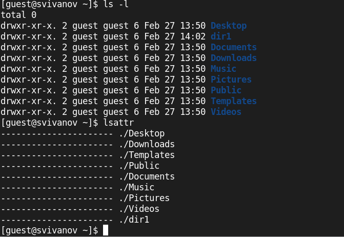{#fig:009 width=70%}

## Снятие атрибутов

Снимем с директории dir1 все атрибуты командой
chmod 000 dir1
и проверим с её помощью правильность выполнения команды
ls -l (рис. 10).

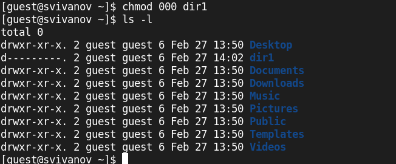{#fig:010 width=70%}

## Попытка создать файл

Попытаемся создать в директории dir1 файл file1 командой
echo "test" > /home/guest/dir1/file1 (рис. 11). 

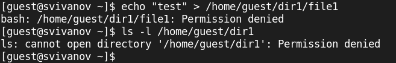{#fig:011 width=70%}

# Заполнение таблицы 

## Определение разрешенных операций

Далее заполняем таблицу 2.1 «Установленные права и разрешённые действия», выполняя действия от имени владельца директории, определив, какие операции разрешены, а какие нет. (рис. 12). 

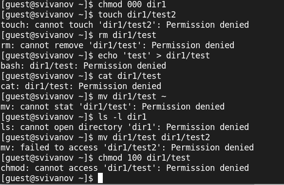{#fig:012 width=70%}

## Определение разрешенных операций

Далее на основе заполненной таблицы 2.1 я определил минимально необходимые права для выполнения операций внутри директории dir1, и заполнил таблицу 2.2 «Минимальные права для совершения операций» (рис. 13). 

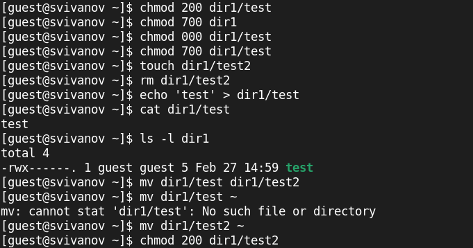{#fig:013 width=70%}

# Вывод

## Вывод 

В ходе работы были получены практические навыки работы в консоли с атрибутами файлов, закрепление теоретических основ дискреционного разграничения доступа в современных системах с открытым кодом на базе ОС Linux.

 
