---
## Front matter
title: "Отчет по лабораторной работе №2"
subtitle: "Дисциплина: Основы информационной безопасности"
author: "Иванов Сергей Владимирович"

## Generic otions
lang: ru-RU
toc-title: "Содержание"

## Bibliography
bibliography: bib/cite.bib
csl: pandoc/csl/gost-r-7-0-5-2008-numeric.csl

## Pdf output format
toc: true # Table of contents
toc-depth: 2
lof: true # List of figures
fontsize: 12pt
linestretch: 1.5
papersize: a4
documentclass: scrreprt
## I18n polyglossia
polyglossia-lang:
  name: russian
  options:
	- spelling=modern
	- babelshorthands=true
polyglossia-otherlangs:
  name: english
## I18n babel
babel-lang: russian
babel-otherlangs: english
## Fonts
mainfont: PT Serif
romanfont: PT Serif
sansfont: PT Sans
monofont: PT Mono
mainfontoptions: Ligatures=TeX
romanfontoptions: Ligatures=TeX
sansfontoptions: Ligatures=TeX,Scale=MatchLowercase
monofontoptions: Scale=MatchLowercase,Scale=0.9
## Biblatex
biblatex: true
biblio-style: "gost-numeric"
biblatexoptions:
  - parentracker=true
  - backend=biber
  - hyperref=auto
  - language=auto
  - autolang=other*
  - citestyle=gost-numeric
## Pandoc-crossref LaTeX customization
figureTitle: "Рис."
listingTitle: "Листинг"
lofTitle: "Список иллюстраций"
lolTitle: "Листинги"
## Misc options
indent: true
header-includes:
  - \usepackage{indentfirst}
  - \usepackage{float} # keep figures where there are in the text
  - \floatplacement{figure}{H} # keep figures where there are in the text
---

# Цель работы

Получение практических навыков работы в консоли с атрибутами файлов, закрепление теоретических основ дискреционного разграничения доступа в современных системах с открытым кодом на базе ОС Linux.

# Выполнение лабораторной работы

Создаем учётную запись пользователя guest (использую учётную запись администратора):
useradd guest
Задаю пароль для пользователя guest (рис. 1) (использую учётную запись администратора):
passwd guest

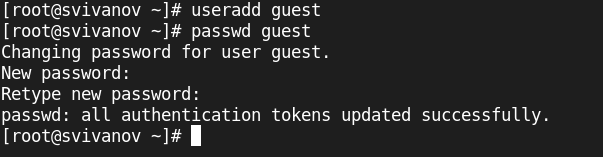{#fig:001 width=70%}

Входим в систему от имени пользователя guest. (рис. 2).

{#fig:002 width=70%}

Определим директорию, в которой мы находимся, командой pwd. Она является домашней. (рис. 3).

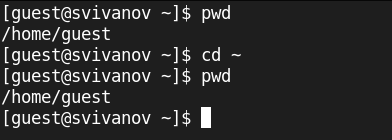{#fig:003 width=70%}

Уточним имя пользователя командой whoami. (рис. 4).

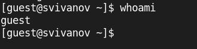{#fig:004 width=70%}

Уточним имя пользователя, его группу, а также группы, куда входит пользователь, командой id и groups. (рис. 5). 

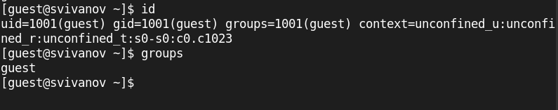{#fig:005 width=70%}

Просмотрим файл /etc/passwd командой
cat /etc/passwd (рис. 6). 

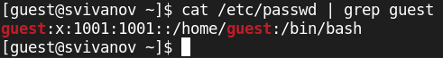{#fig:006 width=70%}

Определите существующие в системе директории командой
ls -l /home/ 
Не удалось получить список поддиректорий директории /home. (рис. 7). 

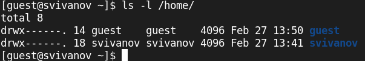{#fig:007 width=70%}

Проверим, какие расширенные атрибуты установлены на поддиректориях, находящихся в директории /home, командой:
lsattr /home
Нам не удалось увидеть расширенные атрибуты директории.
Увидеть расширенные атрибуты директорий других пользователей можно командой 
lsattr /home/guest. (рис. 8).

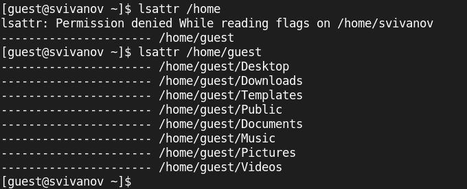{#fig:008 width=70%}

Создадим в домашней директории поддиректорию dir1 командой
mkdir dir1
Определим командами ls -l и lsattr, какие права доступа и расширенные атрибуты были выставлены на директорию dir1. (рис. 9).

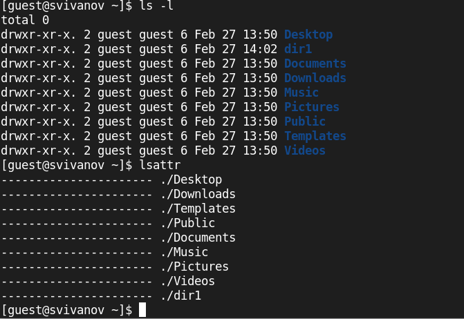{#fig:009 width=70%}

Снимем с директории dir1 все атрибуты командой
chmod 000 dir1
и проверим с её помощью правильность выполнения команды
ls -l (рис. 10).

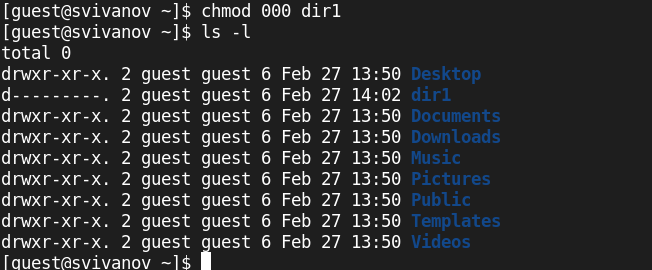{#fig:010 width=70%}

Попытаемся создать в директории dir1 файл file1 командой
echo "test" > /home/guest/dir1/file1
Мы получили отказ в выполнении операции по созданию файла потому что сняли все атрибуты с директории. (рис. 11). 

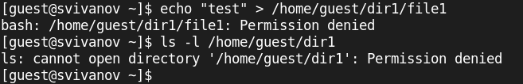{#fig:011 width=70%}

## Заполнение таблицы

Далее заполняем таблицу 2.1 «Установленные права и разрешённые действия», выполняя действия от имени владельца директории (файлов), определив, какие операции разрешены, а какие нет. (рис. 12). 

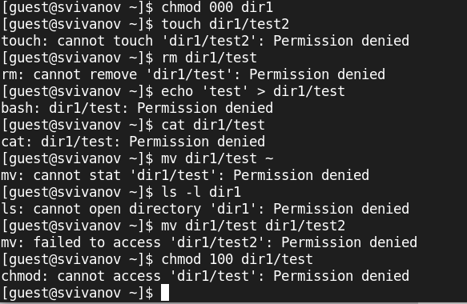{#fig:012 width=70%}

: Установленные права и разрешённые действия

| | | | | | | | | | |
|-|-|-|-|-|-|-|-|-|-|
|Права директории |Права файла|Создание файла|Удаление файла|Запись в файл|Чтение файла|Смена директории|Просмотр файлов в директории|Переименование файла|Смена атрибутов файла|
|d(000)|(000)|-|-|-|-|-|-|-|-|
|d(000)|(100)|-|-|-|-|-|-|-|-|
|d(000)|(200)|-|-|-|-|-|-|-|-|
|d(000)|(300)|-|-|-|-|-|-|-|-|
|d(000)|(400)|-|-|-|-|-|-|-|-|
|d(000)|(500)|-|-|-|-|-|-|-|-|
|d(000)|(600)|-|-|-|-|-|-|-|-|
|d(000)|(700)|-|-|-|-|-|-|-|-|
|d(100)|(000)|-|-|-|-|-|-|-|+|
|d(100)|(100)|-|-|-|-|-|-|-|+|
|d(100)|(200)|-|-|+|-|-|-|-|+|
|d(100)|(300)|-|-|+|-|-|-|-|+|
|d(100)|(400)|-|-|-|+|-|-|-|+|
|d(100)|(500)|-|-|-|+|-|-|-|+|
|d(100)|(600)|-|-|+|+|-|-|-|+|
|d(100)|(700)|-|-|+|+|-|-|-|+|
|d(200)|(000)|-|-|-|-|-|-|-|-|
|d(200)|(100)|-|-|-|-|-|-|-|-|
|d(200)|(200)|-|-|-|-|-|-|-|-|
|d(200)|(300)|-|-|-|-|-|-|-|-|
|d(200)|(400)|-|-|-|-|-|-|-|-|
|d(200)|(500)|-|-|-|-|-|-|-|-|
|d(200)|(600)|-|-|-|-|-|-|-|-|
|d(200)|(700)|-|-|-|-|-|-|-|-|
|d(300)|(000)|+|+|-|-|+|-|+|+|
|d(300)|(100)|+|+|-|-|+|-|+|+|
|d(300)|(200)|+|+|+|-|+|-|+|+|
|d(300)|(300)|+|+|+|-|+|-|+|+|
|d(300)|(400)|+|+|-|+|+|-|+|+|
|d(300)|(500)|+|+|-|+|+|-|+|+|
|d(300)|(600)|+|+|+|+|+|-|+|+|
|d(300)|(700)|+|+|+|+|+|-|+|+|
|d(400)|(000)|-|-|-|-|-|+|-|-|
|d(400)|(100)|-|-|-|-|-|+|-|-|
|d(400)|(200)|-|-|-|-|-|+|-|-|
|d(400)|(300)|-|-|-|-|-|+|-|-|
|d(400)|(400)|-|-|-|-|-|+|-|-|
|d(400)|(500)|-|-|-|-|-|+|-|-|
|d(400)|(600)|-|-|-|-|-|+|-|-|
|d(400)|(700)|-|-|-|-|-|+|-|-|
|d(500)|(000)|-|-|-|-|-|+|-|+|
|d(500)|(100)|-|-|-|-|-|+|-|+|
|d(500)|(200)|-|-|+|-|-|+|-|+|
|d(500)|(300)|-|-|+|-|-|+|-|+|
|d(500)|(400)|-|-|-|+|-|+|-|+|
|d(500)|(500)|-|-|-|+|-|+|-|+|
|d(500)|(600)|-|-|+|+|-|+|-|+|
|d(500)|(700)|-|-|+|+|-|+|-|+|
|d(600)|(000)|-|-|-|-|-|+|-|-|
|d(600)|(100)|-|-|-|-|-|+|-|-|
|d(600)|(200)|-|-|-|-|-|+|-|-|
|d(600)|(300)|-|-|-|-|-|+|-|-|
|d(600)|(400)|-|-|-|-|-|+|-|-|
|d(600)|(500)|-|-|-|-|-|+|-|-|
|d(600)|(600)|-|-|-|-|-|+|-|-|
|d(600)|(700)|-|-|-|-|-|+|-|-|
|d(700)|(000)|+|+|-|-|+|+|+|+|
|d(700)|(100)|+|+|-|-|+|+|+|+|
|d(700)|(200)|+|+|+|-|+|+|+|+|
|d(700)|(300)|+|+|+|-|+|+|+|+|
|d(700)|(400)|+|+|-|+|+|+|+|+|
|d(700)|(500)|+|+|-|+|+|+|+|+|
|d(700)|(600)|+|+|+|+|+|+|+|+|
|d(700)|(700)|+|+|+|+|+|+|+|+|

Процесс выявления разрешенных операций (рис. 13). 

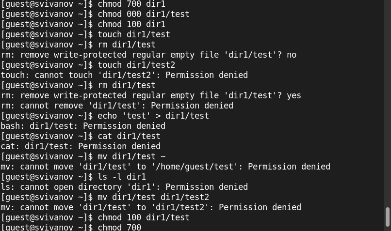{#fig:013 width=70%}

Далее на основе заполненной таблицы 2.1 «Установленные права и разрешённые действия» я определил минимально необходимые права
для выполнения операций внутри директории dir1, и заполнил таблицу 2.2 «Минимальные права для совершения операций» (рис. 14). 

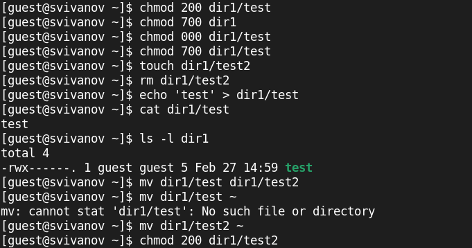{#fig:014 width=70%}

: Минимальные права для совершения операций

| | | | | |
|-|-|-|-|-|
|Операция| |Минимальные  права на  директорию| |Минимальные  права на файл|
|Создание файла| |d(300)| |-|
|Удаление файла| |d(300)| |-|
|Чтение файла| |d(100)| |(400)|
|Запись в файл| |d(100)| |(200)|
|Переименование файла| |d(300)| |(000)|
|Создание поддиректории| |d(300)| |-|
|Удаление поддиректории| |d(300)| |-|

# Вывод

В ходе работы были получены практические навыки работы в консоли с атрибутами файлов, закрепление теоретических основ дискреционного разграничения доступа в современных системах с открытым кодом на базе ОС Linux.

