---
## Front matter
lang: ru-RU
title: Лабораторная работа №3
subtitle: Основы информационной безопасности
author:
  - Иванов Сергей Владимирович, НПИбд-01-23
institute:
  - Российский университет дружбы народов, Москва, Россия
date: 13 марта 2024

## i18n babel
babel-lang: russian
babel-otherlangs: english

## Formatting pdf
toc: false
slide_level: 2
aspectratio: 169
section-titles: true
theme: metropolis
header-includes:
 - \metroset{progressbar=frametitle,sectionpage=progressbar,numbering=fraction}
 - '\makeatletter'
 - '\beamer@ignorenonframefalse'
 - '\makeatother'

 ## Fonts
mainfont: PT Serif
romanfont: PT Serif
sansfont: PT Sans
monofont: PT Mono
mainfontoptions: Ligatures=TeX
romanfontoptions: Ligatures=TeX
sansfontoptions: Ligatures=TeX,Scale=MatchLowercase
monofontoptions: Scale=MatchLowercase,Scale=0.9
---

## Цель работы

Получение практических навыков работы в консоли с атрибутами файлов для групп пользователей.

## Задание

1. Заполнить таблицу «Установленные права и разрешённые действия»
2. Заполнить таблицу «Минимальные права для совершения операций»

# Выполнение работы

## Создание guest2

Создаем учётную запись пользователя guest2 
useradd guest2
Задаю пароль для пользователя guest (рис. 1)
passwd guest2

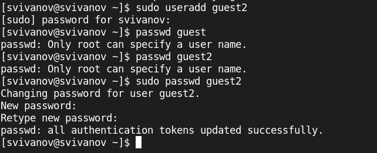{#fig:001 width=70%}

## Добавление в группу

Добавим пользователя guest2 в группу guest:
gpasswd -a guest2 guest. (рис. 2).

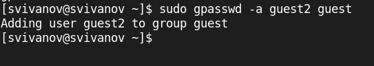{#fig:002 width=70%}

## Опаределяем домашнюю директорию

Осуществим вход в систему от двух пользователей на двух разных консолях: guest на первой консоли и guest2 на второй консоли. (рис. 3, 4).

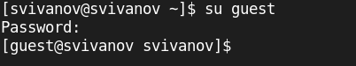{#fig:003 width=70%}

## Опаределяем домашнюю директорию

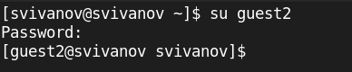{#fig:004 width=70%}

## Команда pwd для guest

Для обоих пользователей командой pwd определим директорию, в которой мы находимся. (рис. 5, 6). 

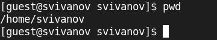{#fig:005 width=70%}

## Команда pwd для guest2

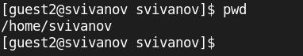{#fig:006 width=70%}

## Информация о пользователе guest

Уточним имя пользователя, его группу, кто входит в неё и к каким группам принадлежит он сам. Определиv командами
groups guest и groups guest2, в какие группы входят пользователи guest и guest2. Сравним вывод команды groups с выводом команд
id -Gn и id -G. (рис. 7, 8). 

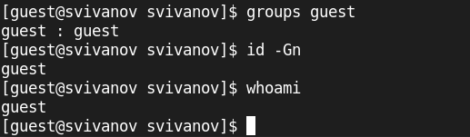{#fig:007 width=70%}

## Информация о пользователе guest2

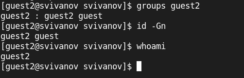{#fig:008 width=70%}

## Информация в файле cat /etc/group

Сравним полученную информацию с содержимым файла /etc/group.
Просмотрим файл командой
cat /etc/group | grep 'guest'(рис. 9, 10).

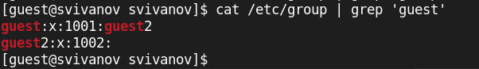{#fig:009 width=70%}

## Информация в файле cat /etc/group

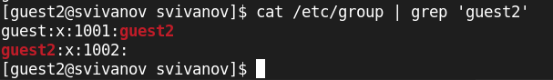{#fig:010 width=70%}

## Регистрация guest2

От имени пользователя guest2 выполним регистрацию пользователя guest2 в группе guest командой
newgrp guest. (рис. 11). 

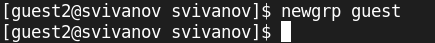{#fig:011 width=70%}

## Изменение прав

От имени пользователя guest изменим права директории /home/guest, разрешив все действия для пользователей группы:
chmod g+rwx /home/guest. (рис. 12). 

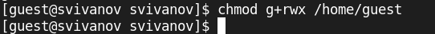{#fig:012 width=70%}

## Снятие всех атрибутов

От имени пользователя guest снимем с директории /home/guest/dir1 все атрибуты командой
chmod 000 dirl (рис. 13). 

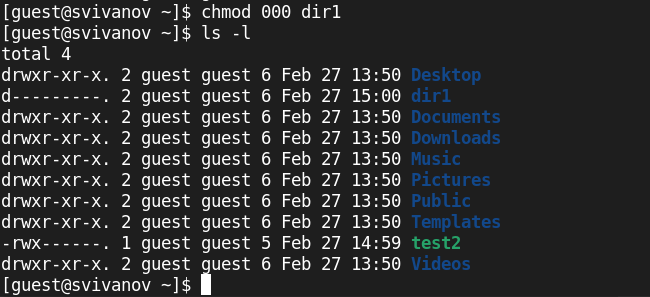{#fig:013 width=70%}

# Заполнение таблицы 

## Снятие всех атрибутов

Далее заполним таблицу 2.1 «Установленные права и разрешённые действия для групп», меняя атрибуты у директории dir1 и файла file1 от имени пользователя guest (рис. 14), (рис. 15)

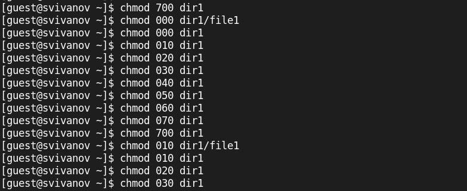{#fig:014 width=70%}

## Снятие всех атрибутов

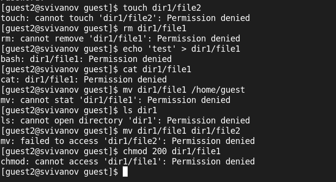{#fig:015 width=70%}

# Вывод

## Вывод 

В ходе работы были получены получены практические навыки работы в консоли с атрибутами файлов для групп пользователей.

 
