---
## Front matter
title: "Отчет по лабораторной работе №3"
subtitle: "Дисциплина: Основы информационной безопасности"
author: "Иванов Сергей Владимирович"

## Generic otions
lang: ru-RU
toc-title: "Содержание"

## Bibliography
bibliography: bib/cite.bib
csl: pandoc/csl/gost-r-7-0-5-2008-numeric.csl

## Pdf output format
toc: true # Table of contents
toc-depth: 2
lof: true # List of figures
fontsize: 12pt
linestretch: 1.5
papersize: a4
documentclass: scrreprt
## I18n polyglossia
polyglossia-lang:
  name: russian
  options:
	- spelling=modern
	- babelshorthands=true
polyglossia-otherlangs:
  name: english
## I18n babel
babel-lang: russian
babel-otherlangs: english
## Fonts
mainfont: PT Serif
romanfont: PT Serif
sansfont: PT Sans
monofont: PT Mono
mainfontoptions: Ligatures=TeX
romanfontoptions: Ligatures=TeX
sansfontoptions: Ligatures=TeX,Scale=MatchLowercase
monofontoptions: Scale=MatchLowercase,Scale=0.9
## Biblatex
biblatex: true
biblio-style: "gost-numeric"
biblatexoptions:
  - parentracker=true
  - backend=biber
  - hyperref=auto
  - language=auto
  - autolang=other*
  - citestyle=gost-numeric
## Pandoc-crossref LaTeX customization
figureTitle: "Рис."
listingTitle: "Листинг"
lofTitle: "Список иллюстраций"
lolTitle: "Листинги"
## Misc options
indent: true
header-includes:
  - \usepackage{indentfirst}
  - \usepackage{float} # keep figures where there are in the text
  - \floatplacement{figure}{H} # keep figures where there are in the text
---

# Цель работы

Получение практических навыков работы в консоли с атрибутами файлов для групп пользователей.

# Выполнение лабораторной работы

Создаем учётную запись пользователя guest2 (использую учётную запись администратора):
useradd guest2
Задаю пароль для пользователя guest (рис. 1) (использую учётную запись администратора):
passwd guest2

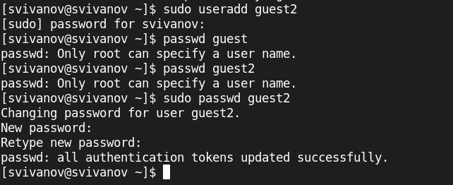{#fig:001 width=70%}

Добавим пользователя guest2 в группу guest:
gpasswd -a guest2 guest. (рис. 2).

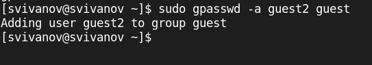{#fig:002 width=70%}

Осуществим вход в систему от двух пользователей на двух разных консолях: guest на первой консоли и guest2 на второй консоли. (рис. 3, 4).

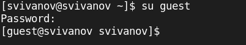{#fig:003 width=70%}

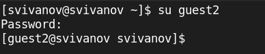{#fig:004 width=70%}

Для обоих пользователей командой pwd определим директорию, в которой мы находимся. (рис. 5, 6). 

{#fig:005 width=70%}

{#fig:006 width=70%}

Уточниv имя пользователя, его группу, кто входит в неё и к каким группам принадлежит он сам. Определиv командами
groups guest и groups guest2, в какие группы входят пользователи guest и guest2. Сравним вывод команды groups с выводом команд
id -Gn и id -G. (рис. 7, 8). 

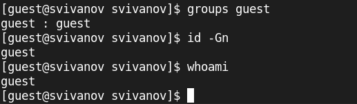{#fig:007 width=70%}

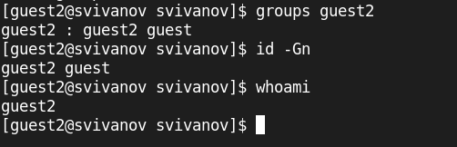{#fig:008 width=70%}

Сравним полученную информацию с содержимым файла /etc/group.
Просмотрим файл командой
cat /etc/group | grep 'guest'(рис. 9, 10).

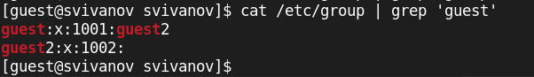{#fig:009 width=70%}

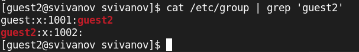{#fig:010 width=70%}

От имени пользователя guest2 выполним регистрацию пользователя guest2 в группе guest командой
newgrp guest. (рис. 11). 

{#fig:011 width=70%}

От имени пользователя guest изменим права директории /home/guest, разрешив все действия для пользователей группы:
chmod g+rwx /home/guest. (рис. 12). 

{#fig:012 width=70%}

От имени пользователя guest снимем с директории /home/guest/dir1 все атрибуты командой
chmod 000 dirl (рис. 13). 

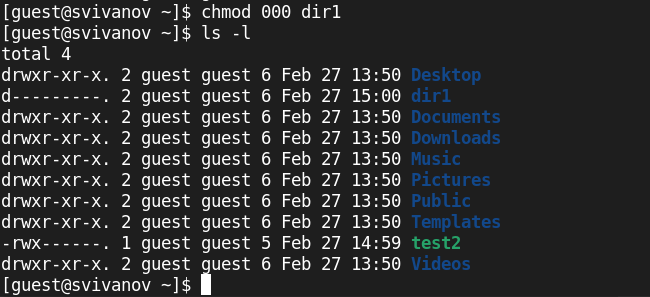{#fig:013 width=70%}

## Заполнение таблицы

Далее заполним таблицу 2.1 «Установленные права и разрешённые действия для групп», меняя атрибуты у директории dir1 и файла file1 от имени пользователя guest и делая проверку от пользователя guest2, определив опытным путём, какие операции разрешены, а какие нет. (рис. 14), (рис. 15)

: Установленные права и разрешённые действия для групп

| Права директории | Права файла |Создание файла | Удаление файла | Запись в файл | Чтение файла |Смена директории | Просмотр файлов в директории | Переименование файла | Смена атрибутов файла |
|:---------------------|:---------------------|-----|-----|-----|-----|-----|-----|-----|-----|
|```d (000) d---------```|```(000) ----------```|-|-|-|-|-|-|-|-|
|```d (010) d-----x---```|```(000) ----------```|-|-|-|-|-|-|-|-|
|```d (020) d----w----```|```(000) ----------```|-|-|-|-|-|-|-|-|
|```d (030) d----wx---```|```(000) ----------```|+|+|-|-|+|-|+|+|
|```d (040) d---r-----```|```(000) ----------```|-|-|-|-|-|-|-|-|
|```d (050) d---r-x---```|```(000) ----------```|-|-|-|-|-|+|-|+|
|```d (060) d---rw----```|```(000) ----------```|-|-|-|-|-|+|-|-|
|```d (070) d---rwx---```|```(000) ----------```|+|+|-|-|+|+|+|+|
|```d (000) d---------```|```(010) ------x---```|-|-|-|-|-|-|-|-|
|```d (010) d-----x---```|```(010) ------x---```|-|-|-|-|-|-|-|+|
|```d (020) d----w----```|```(010) ------x---```|-|-|-|-|-|-|-|-|
|```d (030) d----wx---```|```(010) ------x---```|+|+|-|-|+|-|+|+|
|```d (040) d---r-----```|```(010) ------x---```|-|-|-|-|-|+|-|-|
|```d (050) d---r-x---```|```(010) ------x---```|-|-|-|-|-|+|-|+|
|```d (060) d---rw----```|```(010) ------x---```|-|-|-|-|-|+|-|-|
|```d (070) d---rwx---```|```(010) ------x---```|+|+|-|-|+|+|+|+|
|```d (000) d---------```|```(020) -----w----```|-|-|-|-|-|-|-|-|
|```d (010) d-----x---```|```(020) -----w----```|-|-|+|-|-|-|-|+|
|```d (020) d----w----```|```(020) -----w----```|-|-|-|-|-|-|-|-|
|```d (030) d----wx---```|```(020) -----w----```|+|+|+|-|+|-|+|+|
|```d (040) d---r-----```|```(020) -----w----```|-|-|-|-|-|+|-|-|
|```d (050) d---r-x---```|```(020) -----w----```|-|-|+|-|-|+|-|+|
|```d (060) d---rw----```|```(020) -----w----```|-|-|-|-|-|+|-|-|
|```d (070) d---rwx---```|```(020) -----w----```|+|+|+|-|+|+|+|+|
|```d (000) d---------```|```(030) ----wx---```|-|-|-|-|-|-|-|-|
|```d (010) d-----x---```|```(030) ----wx---```|-|-|+|-|-|-|-|+|
|```d (020) d----w----```|```(030) ----wx---```|-|-|-|-|-|-|-|-|
|```d (030) d----wx---```|```(030) ----wx---```|+|+|+|-|+|-|+|+|
|```d (040) d---r-----```|```(030) ----wx---```|-|-|-|-|-|+|-|-|
|```d (050) d---r-x---```|```(030) ----wx---```|-|-|+|-|-|+|-|+|
|```d (060) d---rw----```|```(030) ----wx---```|-|-|-|-|-|+|-|-|
|```d (070) d---rwx---```|```(030) ----wx---```|+|+|+|-|+|+|+|+|
|```d (000) d---------```|```(040) ----r-----```|-|-|-|-|-|-|-|-|
|```d (010) d-----x---```|```(040) ----r-----```|-|-|-|+|-|-|-|+|
|```d (020) d----w----```|```(040) ----r-----```|-|-|-|-|-|-|-|-|
|```d (030) d----wx---```|```(040) ----r-----```|+|+|-|+|+|-|+|+|
|```d (040) d---r-----```|```(040) ----r-----```|-|-|-|-|-|+|-|-|
|```d (050) d---r-x---```|```(040) ----r-----```|-|-|-|+|-|+|-|+|
|```d (060) d---rw----```|```(040) ----r-----```|-|-|-|-|-|+|-|-|
|```d (070) d---rwx---```|```(040) ----r-----```|+|+|-|+|+|+|+|+|
|```d (000) d---------```|```(050) ----r-x---```|-|-|-|-|-|-|-|-|
|```d (010) d-----x---```|```(050) ----r-x---```|-|-|-|+|-|-|-|+|
|```d (020) d----w----```|```(050) ----r-x---```|-|-|-|-|-|-|-|-|
|```d (030) d----wx---```|```(050) ----r-x---```|+|+|-|+|+|-|+|+|
|```d (040) d---r-----```|```(050) ----r-x---```|-|-|-|-|-|+|-|-|
|```d (050) d---r-x---```|```(050) ----r-x---```|-|-|-|+|-|+|-|+|
|```d (060) d---rw----```|```(050) ----r-x---```|-|-|-|-|-|+|-|-|
|```d (070) d---rwx---```|```(050) ----r-x---```|+|+|-|+|+|+|+|+|
|```d (000) d---------```|```(060) ----rw----```|-|-|-|-|-|-|-|-|
|```d (010) d-----x---```|```(060) ----rw----```|-|-|+|+|-|-|-|+|
|```d (020) d----w----```|```(060) ----rw----```|-|-|-|-|-|-|-|-|
|```d (030) d----wx---```|```(060) ----rw----```|+|+|+|+|+|-|+|+|
|```d (040) d---r-----```|```(060) ----rw----```|-|-|-|-|-|+|-|-|
|```d (050) d---r-x---```|```(060) ----rw----```|-|-|+|+|-|+|-|+|
|```d (060) d---rw----```|```(060) ----rw----```|-|-|-|-|-|+|-|-|
|```d (070) d---rwx---```|```(060) ----rw----```|+|+|+|+|+|+|+|+|
|```d (000) d---------```|```(070) ----rwx---```|-|-|-|-|-|-|-|-|
|```d (010) d-----x---```|```(070) ----rwx---```|-|-|+|+|-|-|-|+|
|```d (020) d----w----```|```(070) ----rwx---```|-|-|-|-|-|-|-|-|
|```d (030) d----wx---```|```(070) ----rwx---```|+|+|+|+|+|-|+|+|
|```d (040) d---r-----```|```(070) ----rwx---```|-|-|-|-|-|+|-|-|
|```d (050) d---r-x---```|```(070) ----rwx---```|-|-|+|+|-|+|-|+|
|```d (060) d---rw----```|```(070) ----rwx---```|-|-|-|-|-|+|-|-|
|```d (070) d---rwx---```|```(070) ----rwx---```|+|+|+|+|+|+|+|+|


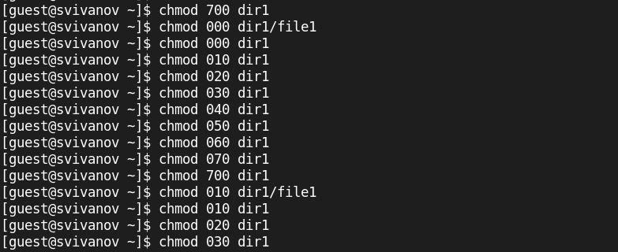{#fig:014 width=70%}

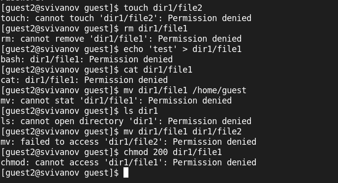{#fig:015 width=70%}

Далее на основании заполненной таблицы 2.1 «Установленные права и разрешённые действия для групп» определим те или иные минимально необходимые права для выполнения операций внутри директории dir1, и заполним таблицу 2.2 «Минимальные права для совершения операций от имени пользователей входящих в группу» 

: Минимальные права для совершения операций от имени пользователей входящих в группу

| Операция | Минимальные  права на  директорию | Минимальные  права на файл |
|------------------------|---------------------------------|---------------------------|
| Создание файла | ```d (030) d----wx---``` | ```-``` |
| Удаление файла | ```d (030) d----wx---``` | ```-``` |
| Чтение файла | ```d (010) d-----x---``` | ```(040) ----r-----``` |
| Запись в файл | ```d (010) d-----x---``` | ```(020) -----w----``` |
| Переименование файла | ```d (030) d----wx---``` | ```(000) ----------``` |
| Создание поддиректории | ```d (030) d----wx---``` | ```-``` |
| Удаление поддиректории | ```d (030) d----wx---``` | ```-``` |


# Вывод

В ходе работы были получены получены практические навыки работы в консоли с атрибутами файлов для групп пользователей.

