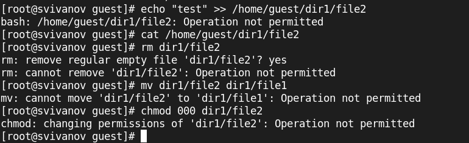

---
## Front matter
lang: ru-RU
title: Лабораторная работа №4
subtitle: Основы информационной безопасности
author:
  - Иванов Сергей Владимирович, НПИбд-01-23
institute:
  - Российский университет дружбы народов, Москва, Россия
date: 20 марта 2024

## i18n babel
babel-lang: russian
babel-otherlangs: english

## Formatting pdf
toc: false
slide_level: 2
aspectratio: 169
section-titles: true
theme: metropolis
header-includes:
 - \metroset{progressbar=frametitle,sectionpage=progressbar,numbering=fraction}
 - '\makeatletter'
 - '\beamer@ignorenonframefalse'
 - '\makeatother'

 ## Fonts
mainfont: PT Serif
romanfont: PT Serif
sansfont: PT Sans
monofont: PT Mono
mainfontoptions: Ligatures=TeX
romanfontoptions: Ligatures=TeX
sansfontoptions: Ligatures=TeX,Scale=MatchLowercase
monofontoptions: Scale=MatchLowercase,Scale=0.9
---

## Цель работы

Получение практических навыков работы в консоли с расширенными
атрибутами файлов.

# Выполнение работы

## Определение атрибутов

От имени пользователя guest определим расширенные атрибуты файла
/home/guest/dir1/file1 командой
lsattr /home/guest/dir1/file1 (рис. 1)

{#fig:001 width=70%}

## Установка прав

Установим командой
chmod 600 file1
на файл file1 права, разрешающие чтение и запись для владельца файла. (рис. 2).

{#fig:002 width=70%}

## Попытка установить атрибут

Попробуем установить на файл /home/guest/dir1/file1 расширенный атрибут a от имени пользователя guest. В ответ получаем отказ от выполнения операции (рис. 3).

{#fig:003 width=70%}

## Установка атрибута

Повысим свои права с помощью команды su. Установим расширенный атрибут a на файл /home/guest/dir1/file1 от имени суперпользователя (рис. 4).

{#fig:004 width=70%}

## Проверка атрибута

От пользователя guest проверим правильность установления атрибута:
lsattr /home/guest/dir1/file1. (рис. 5). 

{#fig:005 width=70%}

## Дозапись в файл

Выполним дозапись в файл file1 слова «test» командой
echo "test" >> /home/guest/dir1/file1
После этого выполним чтение файла file1 (рис. 6).

{#fig:006 width=70%}

## Попытка удаления

Попробуем удалить файл file1. Удаление запрещено. (рис. 7). 

{#fig:007 width=70%}

## Попытка переименования

Попробуем переименовать файл. Переименование запрещено. (рис. 8). 

{#fig:008 width=70%}

## Попытка установки прав

Попробуем с помощью команды chmod установить права 000 на file1. Операция запрещена. (рис. 9).

{#fig:009 width=70%}

## Снятие расширенного атрибута

Снимем расширенный атрибут a с файла /home/guest/dirl/file1 от
имени суперпользователя (рис. 10). 

{#fig:010 width=70%}

## Повторение операций

Повторим операции, которые ранее не удавалось выполнить. Теперь все операции разрешены. (рис. 11). 

{#fig:011 width=70%}

## Замена атрибута

Заменим атрибут 'a' атрибутом 'i' . (рис. 12). 

{#fig:012 width=70%}

## Повторение операций

Повторим все действия. Видим, что все действия запрещены кроме чтения файла. (рис. 13). 

{#fig:013 width=70%}

# Вывод

## Вывод 

В ходе работы были получены практические навыки работы в консоли с расширенными атрибутами файлов.

 
