---
## Front matter
title: "Отчет по лабораторной работе №4"
subtitle: "Дисциплина: Основы информационной безопасности"
author: "Иванов Сергей Владимирович"

## Generic otions
lang: ru-RU
toc-title: "Содержание"

## Bibliography
bibliography: bib/cite.bib
csl: pandoc/csl/gost-r-7-0-5-2008-numeric.csl

## Pdf output format
toc: true # Table of contents
toc-depth: 2
lof: true # List of figures
fontsize: 12pt
linestretch: 1.5
papersize: a4
documentclass: scrreprt
## I18n polyglossia
polyglossia-lang:
  name: russian
  options:
	- spelling=modern
	- babelshorthands=true
polyglossia-otherlangs:
  name: english
## I18n babel
babel-lang: russian
babel-otherlangs: english
## Fonts
mainfont: PT Serif
romanfont: PT Serif
sansfont: PT Sans
monofont: PT Mono
mainfontoptions: Ligatures=TeX
romanfontoptions: Ligatures=TeX
sansfontoptions: Ligatures=TeX,Scale=MatchLowercase
monofontoptions: Scale=MatchLowercase,Scale=0.9
## Biblatex
biblatex: true
biblio-style: "gost-numeric"
biblatexoptions:
  - parentracker=true
  - backend=biber
  - hyperref=auto
  - language=auto
  - autolang=other*
  - citestyle=gost-numeric
## Pandoc-crossref LaTeX customization
figureTitle: "Рис."
listingTitle: "Листинг"
lofTitle: "Список иллюстраций"
lolTitle: "Листинги"
## Misc options
indent: true
header-includes:
  - \usepackage{indentfirst}
  - \usepackage{float} # keep figures where there are in the text
  - \floatplacement{figure}{H} # keep figures where there are in the text
---

# Цель работы

Получение практических навыков работы в консоли с расширенными
атрибутами файлов.

# Выполнение лабораторной работы

От имени пользователя guest определим расширенные атрибуты файла
/home/guest/dir1/file1 командой
lsattr /home/guest/dir1/file1 (рис. 1)

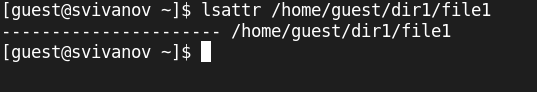{#fig:001 width=70%}

Установим командой
chmod 600 file1
на файл file1 права, разрешающие чтение и запись для владельца файла. (рис. 2).

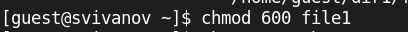{#fig:002 width=70%}

Попробуем установить на файл /home/guest/dir1/file1 расширенный атрибут a от имени пользователя guest:
chattr +a /home/guest/dir1/file1
В ответ получаем отказ от выполнения операции (рис. 3).

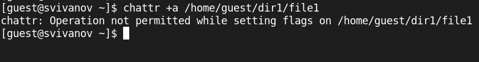{#fig:003 width=70%}

Повысим свои права с помощью команды su. Установим расширенный атрибут a на файл /home/guest/dir1/file1 от имени суперпользователя:
chattr +a /home/guest/dir1/file1 (рис. 4).

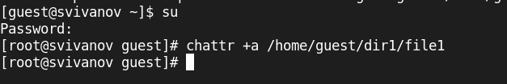{#fig:004 width=70%}

От пользователя guest проверим правильность установления атрибута:
lsattr /home/guest/dir1/file1. (рис. 5). 

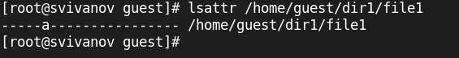{#fig:005 width=70%}
 
Выполним дозапись в файл file1 слова «test» командой
echo "test" >> /home/guest/dir1/file1
После этого выполним чтение файла file1 командой
cat /home/guest/dir1/file1 (рис. 6).

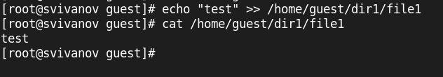{#fig:006 width=70%}

Попробуем удалить файл file1. Удаление запрещено. (рис. 7). 

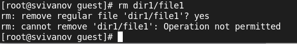{#fig:007 width=70%}

Попробуем переименовать файл. Переименование запрещено. (рис. 8). 

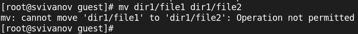{#fig:008 width=70%}

Попробуем с помощью команды chmod установить права 000 на file1. Операция запрещена. (рис. 9).

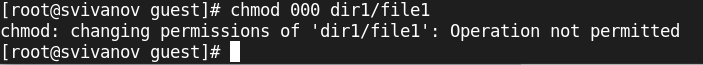{#fig:009 width=70%}

Снимем расширенный атрибут a с файла /home/guest/dirl/file1 от
имени суперпользователя командой
chattr -a /home/guest/dir1/file1 (рис. 10). 

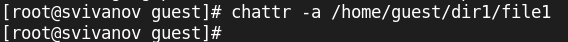{#fig:010 width=70%}

Повторим операции, которые ранее не удавалось выполнить. Теперь все операции разрешены. (рис. 11). 

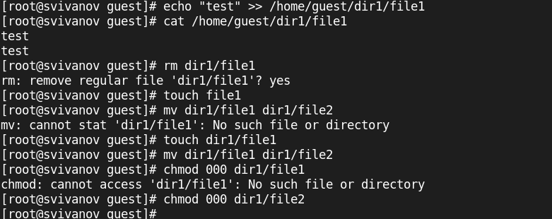{#fig:011 width=70%}

Заменим атрибут 'a' атрибутом 'i' . (рис. 12). 

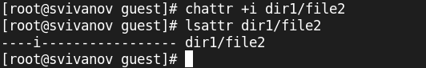{#fig:012 width=70%}

Повторим все действия. Видим, что все действия запрещены кроме чтения файла. (рис. 13). 

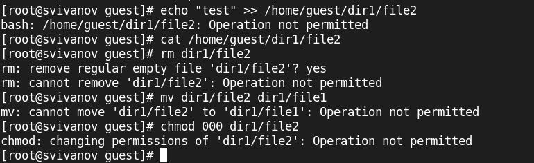{#fig:013 width=70%}

# Вывод

В ходе работы были получены практические навыки работы в консоли с расширенными атрибутами файлов.

