---
## Front matter
lang: ru-RU
title: Лабораторная работа №5
subtitle: Основы информационной безопасности
author:
  - Иванов Сергей Владимирович, НПИбд-01-23
institute:
  - Российский университет дружбы народов, Москва, Россия
date: 3 апреля 2025

## i18n babel
babel-lang: russian
babel-otherlangs: english

## Formatting pdf
toc: false
slide_level: 2
aspectratio: 169
section-titles: true
theme: metropolis
header-includes:
 - \metroset{progressbar=frametitle,sectionpage=progressbar,numbering=fraction}
 - '\makeatletter'
 - '\beamer@ignorenonframefalse'
 - '\makeatother'

 ## Fonts
mainfont: PT Serif
romanfont: PT Serif
sansfont: PT Sans
monofont: PT Mono
mainfontoptions: Ligatures=TeX
romanfontoptions: Ligatures=TeX
sansfontoptions: Ligatures=TeX,Scale=MatchLowercase
monofontoptions: Scale=MatchLowercase,Scale=0.9
---

## Цель работы

Изучение механизмов изменения идентификаторов, применения
SetUID- и Sticky-битов. Получение практических навыков работы в консоли с дополнительными атрибутами. Рассмотрение работы механизма
смены идентификатора процессов пользователей, а также влияние бита
Sticky на запись и удаление файлов.

# Выполнение работы

## Создание программы

Создаем программу simpleid.c (рис. 1)

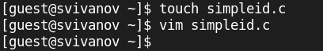{#fig:001 width=70%}

## Содержимое программы

Содержимое программы (рис. 2).

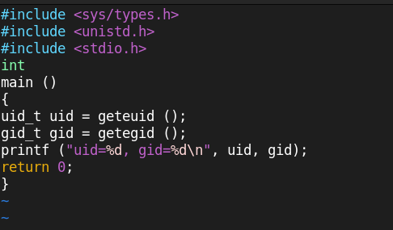{#fig:002 width=70%}

## Компиляция и выполнение

Скомпилируем программу и выполним её (рис. 3).

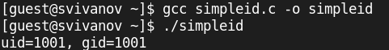{#fig:003 width=70%}

## Системный id

Выполним системную программу id. Сравним полученный результат с данными предыдущего пункта и видим что они совпадают (рис. 4).

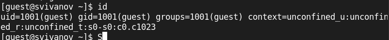{#fig:004 width=70%}

## Усложнение программы

Усложним программу и назевем ее simpleid2.c (рис. 5). 

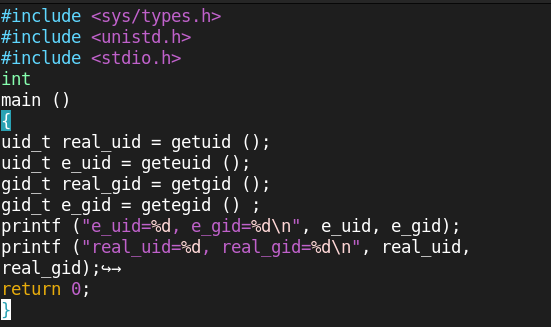{#fig:005 width=70%}

## Компиляция и запуск

Скомпилируем и запустим программу (рис. 6).

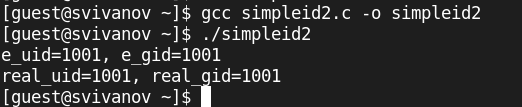{#fig:006 width=70%}

## Смена владельца директории и прав доступа файла

От имени суперпользователя выполним команды: (рис. 7). 

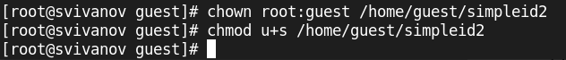{#fig:007 width=70%}

## Проверка смены атрибутов

Выполним проверку правильности установки новых атрибутов и смены
владельца файла simpleid2 (рис. 8). 

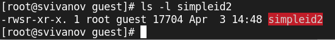{#fig:008 width=70%}

## Запуск программы и id

Запустим simpleid2 и id. 
Видим что вывод id более подробный (рис. 9).

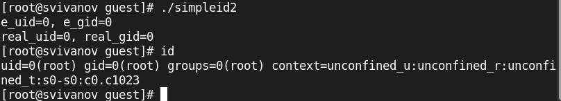{#fig:009 width=70%}

## Создание и компиляция программы

Создание и компиляция пррграммы readfile.c (рис. 10). 

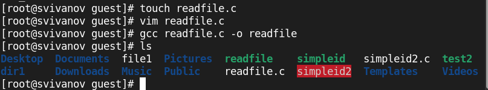{#fig:010 width=70%}

## Смена прав и владельца readfile.c

Сменим владельца у файла readfile.c и изменим права так, чтобы только суперпользователь мог прочитать его, a guest не мог. (рис. 11). 

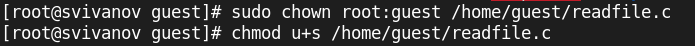{#fig:011 width=70%}

## Проверка чтения файла

Проверим, что пользователь guest не может прочитать файл readfile.c (рис. 12). 

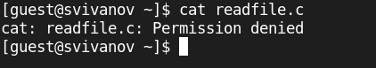{#fig:012 width=70%}

## Проверка чтения файла программой

Проверим, может ли программа readfile прочитать файл /etc/shadow? Не может (рис. 13). 

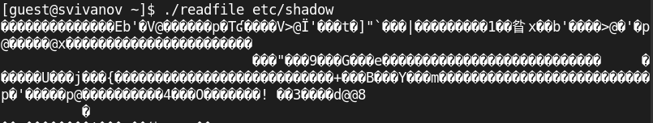{#fig:013 width=70%}

## Проверка атрибута Sticky

Выясним, установлен ли атрибут Sticky на директории /tmp, для чего выполним команду (рис. 14)

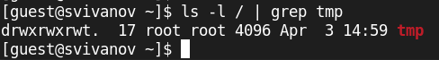{#fig:014 width=70%}

## Создание файла, изменение прав доступа

От имени пользователя guest создадим файл file01.txt в директории /tmp
со словом test. 
Просмотрим атрибуты у только что созданного файла и разрешим чтение и запись для категории пользователей «все остальные» (рис. 15)

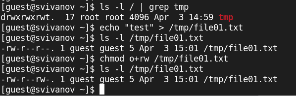{#fig:015 width=70%}

## Попытка чтения и записи

От пользователя guest2 попробуем прочитать файл /tmp/file01.txt, дозаписать слово test2. 
Прочитать удалось, а записать нет (рис. 16)

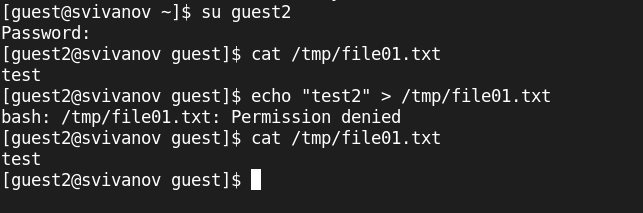{#fig:016 width=70%}

## Попытка удаления

От пользователя guest2 попробуем удалить файл /tmp/file01.txt. 
Не удалось удалить файл (рис. 18)

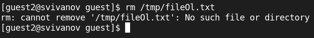{#fig:018 width=70%}

## Снимаем атрибут Sticky

Повысим свои права до суперпользователя и выполним команду, снимающую атрибут t с директории. 
Покинем режим суперпользователя командой
exit (рис. 19)

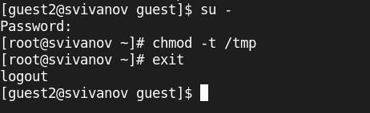{#fig:019 width=70%}

## Проверим снятие атрибута

От пользователя guest2 проверим, что атрибута t у директории /tmp
нет (рис. 20)

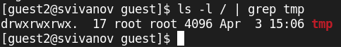{#fig:020 width=70%}

## Проверка предыдущих шагов

Повторите предыдущие шаги. Записать в файл не получилось, но теперь стало доступно удаление. (рис. 21)

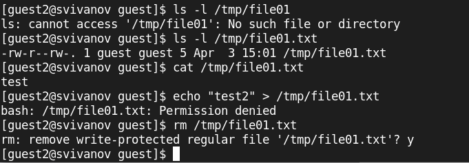{#fig:021 width=70%}

## Возвращение атрибута t

Повысим свои права до суперпользователя и вернём атрибут t на директорию /tmp (рис. 22)

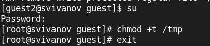{#fig:022 width=70%}

# Вывод

## Вывод 

В ходе работы были изучены механизмов изменения идентификаторов. Получены практических навыков работы с дополнительными атрибутами. Рассмотрены работы механизма смены идентификатора процессов пользователей, а также влияние бита
Sticky на запись и удаление файлов.

 
