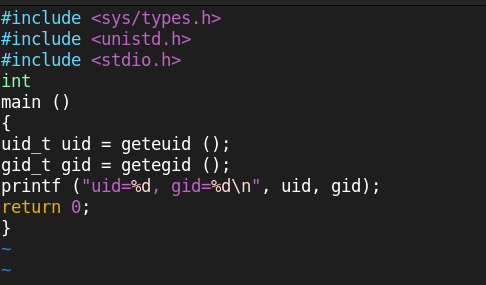

---
## Front matter
title: "Отчет по лабораторной работе №5"
subtitle: "Дисциплина: Основы информационной безопасности"
author: "Иванов Сергей Владимирович"

## Generic otions
lang: ru-RU
toc-title: "Содержание"

## Bibliography
bibliography: bib/cite.bib
csl: pandoc/csl/gost-r-7-0-5-2008-numeric.csl

## Pdf output format
toc: true # Table of contents
toc-depth: 2
lof: true # List of figures
fontsize: 12pt
linestretch: 1.5
papersize: a4
documentclass: scrreprt
## I18n polyglossia
polyglossia-lang:
  name: russian
  options:
	- spelling=modern
	- babelshorthands=true
polyglossia-otherlangs:
  name: english
## I18n babel
babel-lang: russian
babel-otherlangs: english
## Fonts
mainfont: PT Serif
romanfont: PT Serif
sansfont: PT Sans
monofont: PT Mono
mainfontoptions: Ligatures=TeX
romanfontoptions: Ligatures=TeX
sansfontoptions: Ligatures=TeX,Scale=MatchLowercase
monofontoptions: Scale=MatchLowercase,Scale=0.9
## Biblatex
biblatex: true
biblio-style: "gost-numeric"
biblatexoptions:
  - parentracker=true
  - backend=biber
  - hyperref=auto
  - language=auto
  - autolang=other*
  - citestyle=gost-numeric
## Pandoc-crossref LaTeX customization
figureTitle: "Рис."
listingTitle: "Листинг"
lofTitle: "Список иллюстраций"
lolTitle: "Листинги"
## Misc options
indent: true
header-includes:
  - \usepackage{indentfirst}
  - \usepackage{float} # keep figures where there are in the text
  - \floatplacement{figure}{H} # keep figures where there are in the text
---

# Цель работы

Изучение механизмов изменения идентификаторов, применения
SetUID- и Sticky-битов. Получение практических навыков работы в консоли с дополнительными атрибутами. Рассмотрение работы механизма
смены идентификатора процессов пользователей, а также влияние бита
Sticky на запись и удаление файлов.

# Выполнение лабораторной работы

Создаем программу simpleid.c (рис. 1)

{#fig:001 width=70%}

Содержимое программы (рис. 2).
```c
#include <sys/types.h>
#include <unistd.h>
#include <stdio.h>
int
main ()
{
  uid_t uid = geteuid ();
  gid_t gid = getegid ();
  printf ("uid=%d, gid=%d\n", uid, gid);
  return 0;
}
```

{#fig:002 width=70%}

Скомпилируем программу и выполним её (рис. 3).

{#fig:003 width=70%}

Выполним системную программу id. Сравним полученный результат с данными предыдущего пункта и видим что они совпадают (рис. 4).

{#fig:004 width=70%}

Усложним программу и назевем ее simpleid2.c (рис. 5). 

```c
#include <sys/types.h>
#include <unistd.h>
#include <stdio.h>
int
main ()
{
  uid_t real_uid = getuid ();
  uid_t e_uid = geteuid ();
  gid_t real_gid = getgid ();
  gid_t e_gid = getegid () ;
  printf ("e_uid=%d, e_gid=%d\n", e_uid, e_gid);
  printf ("real_uid=%d, real_gid=%d\n", real_uid, real_gid);
  return 0;
}
```

{#fig:005 width=70%}
 
Скомпилируем и запустим программу (рис. 6).

{#fig:006 width=70%}

От имени суперпользователя выполним команды:
chown root:guest /home/guest/simpleid2
chmod u+s /home/guest/simpleid2. (рис. 7). 

{#fig:007 width=70%}

Выполним проверку правильности установки новых атрибутов и смены
владельца файла simpleid2:
ls -l simpleid2. (рис. 8). 

{#fig:008 width=70%}

Запустим simpleid2 и id:
./simpleid2
id 
Видим что вывод id более подробный (рис. 9).

{#fig:009 width=70%}

Создание и компиляция пррграммы readfile.c (рис. 10). 

```c
#include <fcntl.h>
#include <stdio.h>
#include <sys/stat.h>
#include <sys/types.h>
#include <unistd.h>
int
main (int argc, char* argv[])
{
  unsigned char buffer[16];
  size_t bytes_read;
  int i;
  int fd = open (argv[1], O_RDONLY);
  do
  {
    bytes_read = read (fd, buffer, sizeof (buffer));
    for (i =0; i < bytes_read; ++i) printf("%c", buffer[i]);
  }
  while (bytes_read == sizeof (buffer));
  close (fd);
  return 0;
}

```

{#fig:010 width=70%}

Сменим владельца у файла readfile.c и изменим права так, чтобы только суперпользователь мог прочитать его, a guest не мог. (рис. 11). 

{#fig:011 width=70%}

Проверим, что пользователь guest не может прочитать файл readfile.c (рис. 12). 

{#fig:012 width=70%}

Проверим, может ли программа readfile прочитать файл /etc/shadow? Не может (рис. 13). 

{#fig:013 width=70%}

Выясним, установлен ли атрибут Sticky на директории /tmp, для чего выполним команду
ls -l / | grep tmp (рис. 14)

{#fig:014 width=70%}

От имени пользователя guest создадим файл file01.txt в директории /tmp
со словом test:
echo "test" > /tmp/file01.txt
Просмотрим атрибуты у только что созданного файла и разрешим чтение и запись для категории пользователей «все остальные»:
ls -l /tmp/file01.txt
chmod o+rw /tmp/file01.txt
ls -l /tmp/file01.txt (рис. 15)

{#fig:015 width=70%}

От пользователя guest2 попробуем прочитать файл /tmp/file01.txt, дозаписать слово test2:
cat /tmp/file01.txt
echo "test2" > /tmp/file01.txt
Прочитать удалось, а записать нет (рис. 16)

{#fig:016 width=70%}

От пользователя guest2 попробуем записать в файл /tmp/file01.txt
слово test3, стерев при этом всю имеющуюся в файле информацию командой
echo "test3" > /tmp/file01.txt 
Операцию выполнить не удалось (рис. 17)

{#fig:017 width=70%}

От пользователя guest2 попробуем удалить файл /tmp/file01.txt командой
rm /tmp/fileOl.txt 
Не удалось удалить файл (рис. 18)

{#fig:018 width=70%}

Повысим свои права до суперпользователя и выполним команду, снимающую атрибут t с директории:
chmod -t /tmp
Покинем режим суперпользователя командой
exit (рис. 19)

{#fig:019 width=70%}

От пользователя guest2 проверим, что атрибута t у директории /tmp
нет:
ls -l / | grep tmp (рис. 20)

{#fig:020 width=70%}

Повторите предыдущие шаги. Записать в файл не получилось, но теперь стало доступно удаление. (рис. 21)

{#fig:021 width=70%}

Повысим свои права до суперпользователя и вернём атрибут t на директорию /tmp (рис. 22)

{#fig:022 width=70%}

# Вывод

В ходе работы были изучены механизмов изменения идентификаторов. Получены практических навыков работы с дополнительными атрибутами. Рассмотрены работы механизма
смены идентификатора процессов пользователей, а также влияние бита
Sticky на запись и удаление файлов.

