---
## Front matter
lang: ru-RU
title: Лабораторная работа №6
subtitle: Основы информационной безопасности
author:
  - Иванов Сергей Владимирович, НПИбд-01-23
institute:
  - Российский университет дружбы народов, Москва, Россия
date: 18 апреля 2025

## i18n babel
babel-lang: russian
babel-otherlangs: english

## Formatting pdf
toc: false
slide_level: 2
aspectratio: 169
section-titles: true
theme: metropolis
header-includes:
 - \metroset{progressbar=frametitle,sectionpage=progressbar,numbering=fraction}
 - '\makeatletter'
 - '\beamer@ignorenonframefalse'
 - '\makeatother'

 ## Fonts
mainfont: PT Serif
romanfont: PT Serif
sansfont: PT Sans
monofont: PT Mono
mainfontoptions: Ligatures=TeX
romanfontoptions: Ligatures=TeX
sansfontoptions: Ligatures=TeX,Scale=MatchLowercase
monofontoptions: Scale=MatchLowercase,Scale=0.9
---

## Цель работы

Развить навыки администрирования ОС Linux. Получить первое практическое знакомство с технологией SELinux.
Проверить работу SELinx на практике совместно с веб-сервером Apache.

# Выполнение работы

## Проверка режима SELinux

Убедимся, что SELinux работает в режиме enforcing политики targeted (рис. 1)

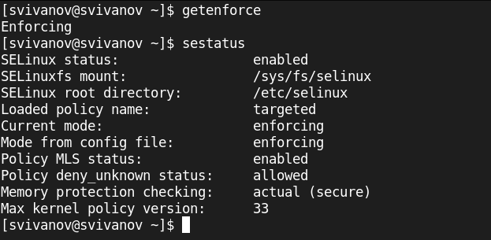{#fig:001 width=70%}

## Проверка службы apache

Запускаю сервер apache, проверяю статус службы, убеждаюсь что она запущена. (рис. 2).

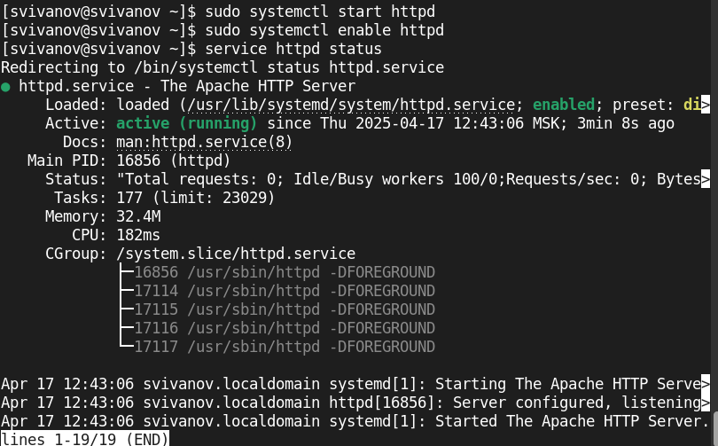{#fig:002 width=70%}

## Проверка работы Apache

Найдем веб-сервер Apache в списке процессов, определим его контекст
безопасности. Его контекст безопасности httpd_t (рис. 3).

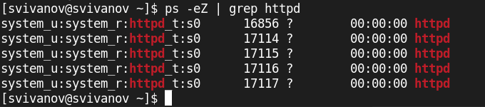{#fig:003 width=70%}

## Состояние переключателей

Посмотрим текущее состояние переключателей SELinux для Apache (рис. 4).

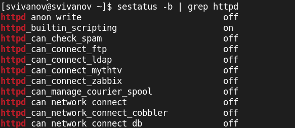{#fig:004 width=70%}

## Статистика по политике

Посмотрим статистику по политике с помощью команды seinfo, множество пользователей - 8, ролей - 15, типов - 5169 (рис. 5). 

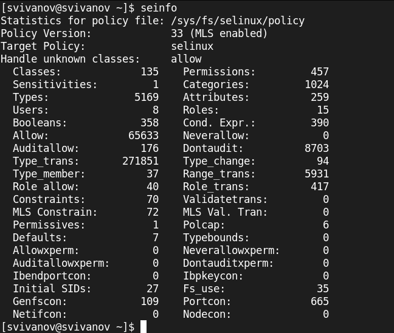{#fig:005 width=70%}

## Типы поддиректорий
 
Определим тип файлов и поддиректорий, находящихся в директории
/var/www. Файлов 0, 2 поддиректории, владелец - root (рис. 6).

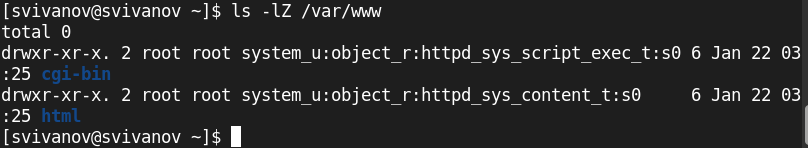{#fig:006 width=70%}

## Тип файлов

Определим тип файлов, находящихся в директории /var/www/html. Файлов нет (рис. 7). 

{#fig:007 width=70%}

## Создание файла

Создадим от имени суперпользователя html-файл
/var/www/html/test.html (рис. 8). 

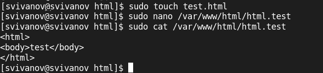{#fig:008 width=70%}

## Проверка контекста

Проверим контекст созданного файла. Контекст - httpd_sys_content_d (рис. 9).

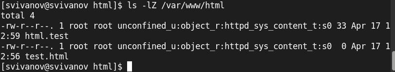{#fig:009 width=70%}

## Отображение файла

Обратитимся к файлу через веб-сервер, введя в браузере адрес
http://127.0.0.1/test.html. (рис. 10). 

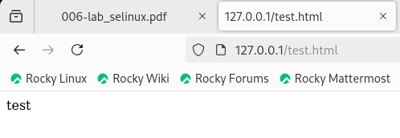{#fig:010 width=70%}

## Изучение справки

Изучим справку man httpd_selinux. (рис. 11). 

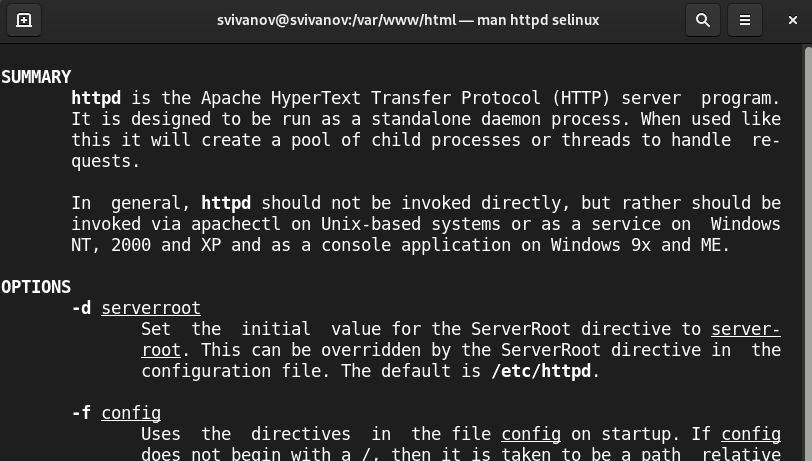{#fig:011 width=70%}

## Изменение контекста файла

Изменим контекст файла /var/www/html/test.html с
httpd_sys_content_t на samba_share_t: (рис. 12). 

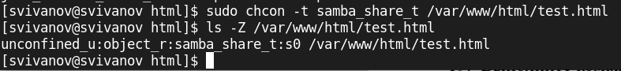{#fig:012 width=70%}

## Отображение файла(ошибка)

Попробуем ещё раз получить доступ к файлу через веб-сервер, введя в
браузере адрес http://127.0.0.1/test.html. Мы получили
сообщение об ошибке: (рис. 13). 

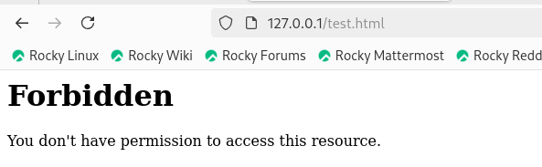{#fig:013 width=70%}

## Просмотр log-файлов

Файл не был отображен потому что мы установили контекст, к котрому процесс httpd не имеет доступа. 
Просмотрим log-файлы веб-сервера Apache. Также просмотрим системный лог-файл. (рис. 14)

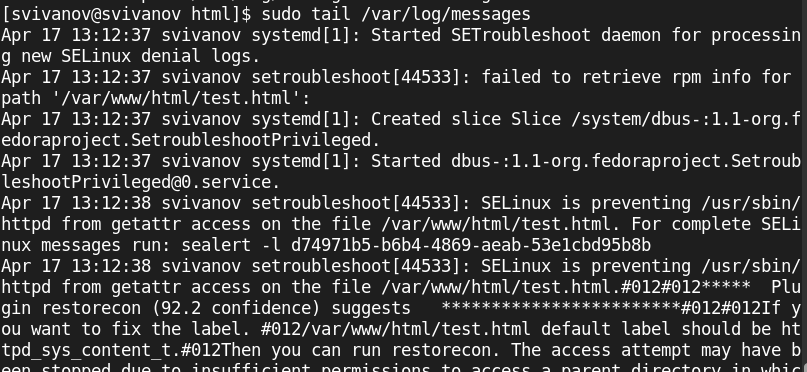{#fig:014 width=70%}

## Изменение номера порта

Попробуем запустить веб-сервер Apache на прослушивание ТСР-порта 81. Для
этого в файле /etc/httpd/httpd.conf найдем строчку Listen 80 и
заменим её на Listen 81. (рис. 15)

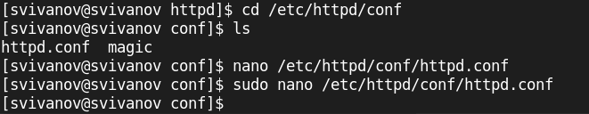{#fig:015 width=70%}

## Изменение порта

Изменение порта (рис. 16)

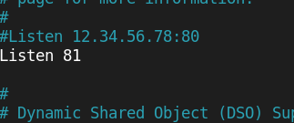{#fig:016 width=70%}

## Попытка прослушивания 81 порта

Выполним перезапуск веб-сервера Apache. Произошёл сбой, потому что порт 81 не добавлен в список прослушиваемых портов (рис. 17)

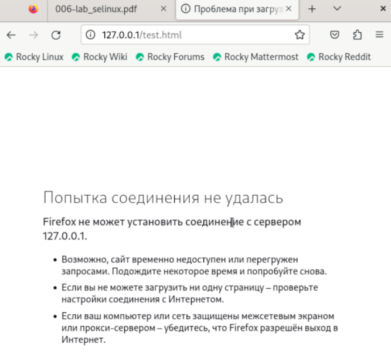{#fig:017 width=70%}

## log-файл

Проанализируем лог-файлы: (рис. 18)

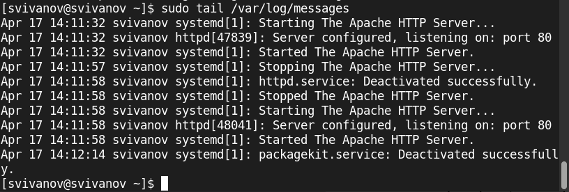{#fig:018 width=70%}

## log-файлы

Просмотрим файлы /var/log/http/error_log,
/var/log/http/access_log и /var/log/audit/audit.log. 
Записи появились в файле error_log (рис. 19)

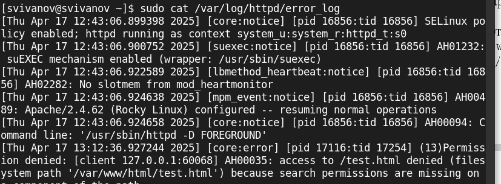{#fig:019 width=70%}

## Добавление и проверка портов

Выполним команду
semanage port -a -t http_port_t -р tcp 81
После этого проверим список портов командой (рис. 20)

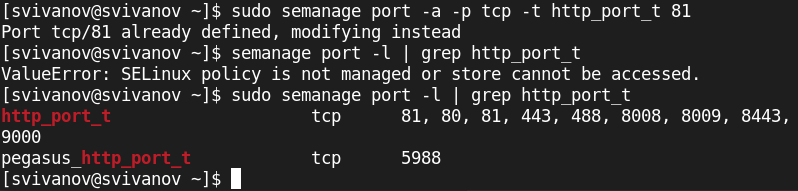{#fig:020 width=70%}

## Перезапуск сервера

Попробуем запустить веб-сервер Apache ещё раз. 
Вернем контекст httpd_sys_cоntent__t к файлу /var/www/html/ test.html: (рис. 21)

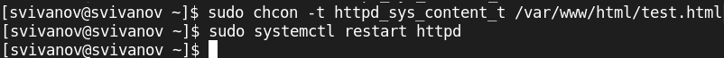{#fig:021 width=70%}

## Проверка сервера

Сервер запустился, т.к порт 81 теперь прослушивается. (рис. 22)

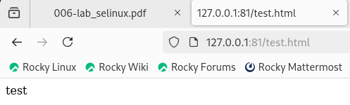{#fig:022 width=70%}

## Удаление порта

Исправим обратно конфигурационный файл apache, вернув Listen 80.
Удалим привязку http_port_t к 81 порту и проверим, что порт 81 удалён. (рис. 23)

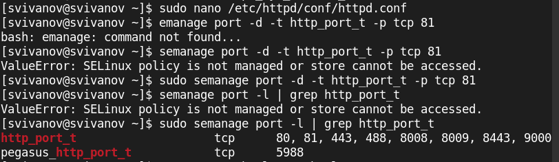{#fig:023 width=70%}

## Удаление файла

Удалим файл /var/www/html/test.html. (рис. 24)

{#fig:024 width=70%}

# Вывод

## Вывод 

В ходе работы были развиты навыки администрирования ОС Linux. Получено первое практическое знакомство с технологией SELinux.
Проверена работу SELinx на практике совместно с веб-сервером Apache.

 
