---
## Front matter
title: "Отчет по лабораторной работе №6"
subtitle: "Дисциплина: Основы информационной безопасности"
author: "Иванов Сергей Владимирович"

## Generic otions
lang: ru-RU
toc-title: "Содержание"

## Bibliography
bibliography: bib/cite.bib
csl: pandoc/csl/gost-r-7-0-5-2008-numeric.csl

## Pdf output format
toc: true # Table of contents
toc-depth: 2
lof: true # List of figures
fontsize: 12pt
linestretch: 1.5
papersize: a4
documentclass: scrreprt
## I18n polyglossia
polyglossia-lang:
  name: russian
  options:
	- spelling=modern
	- babelshorthands=true
polyglossia-otherlangs:
  name: english
## I18n babel
babel-lang: russian
babel-otherlangs: english
## Fonts
mainfont: PT Serif
romanfont: PT Serif
sansfont: PT Sans
monofont: PT Mono
mainfontoptions: Ligatures=TeX
romanfontoptions: Ligatures=TeX
sansfontoptions: Ligatures=TeX,Scale=MatchLowercase
monofontoptions: Scale=MatchLowercase,Scale=0.9
## Biblatex
biblatex: true
biblio-style: "gost-numeric"
biblatexoptions:
  - parentracker=true
  - backend=biber
  - hyperref=auto
  - language=auto
  - autolang=other*
  - citestyle=gost-numeric
## Pandoc-crossref LaTeX customization
figureTitle: "Рис."
listingTitle: "Листинг"
lofTitle: "Список иллюстраций"
lolTitle: "Листинги"
## Misc options
indent: true
header-includes:
  - \usepackage{indentfirst}
  - \usepackage{float} # keep figures where there are in the text
  - \floatplacement{figure}{H} # keep figures where there are in the text
---

# Цель работы

Развить навыки администрирования ОС Linux. Получить первое практическое знакомство с технологией SELinux.
Проверить работу SELinx на практике совместно с веб-сервером Apache.

# Выполнение лабораторной работы

Убедимся, что SELinux работает в режиме enforcing политики targeted с помощью команд getenforce и sestatus (рис. 1)

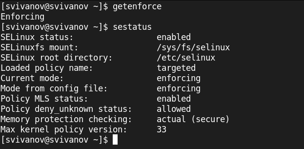{#fig:001 width=70%}

Запускаю сервер apache, проверяю статус службы, убеждаюсь что она запущена. (рис. 2).

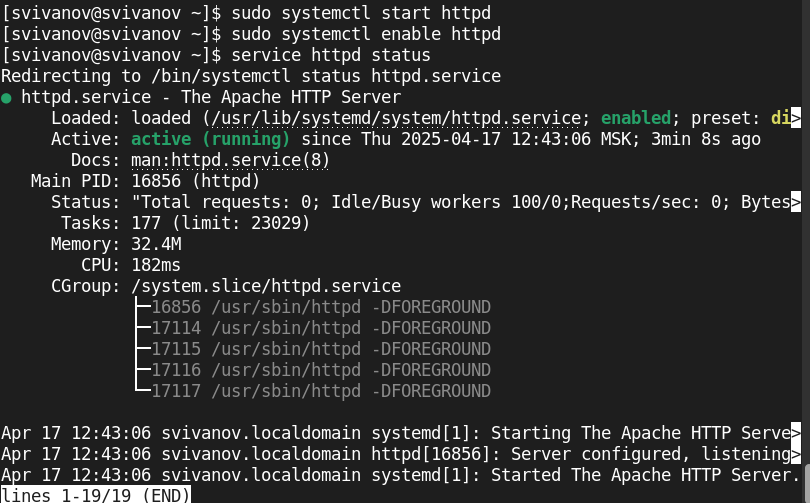{#fig:002 width=70%}

Найдем веб-сервер Apache в списке процессов, определим его контекст
безопасности командой
ps -eZ | grep httpd.
Его контекст безопасности httpd_t (рис. 3).

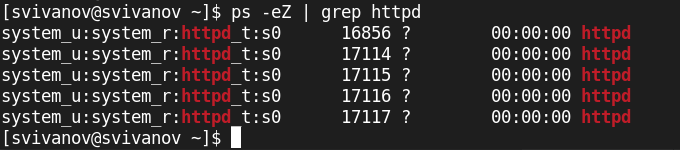{#fig:003 width=70%}

Посмотрим текущее состояние переключателей SELinux для Apache с помощью команды
sestatus -bigrep httpd (рис. 4).

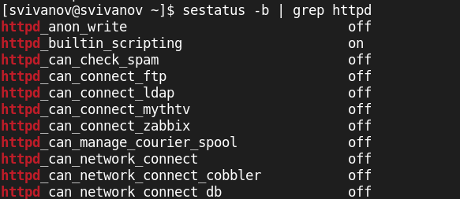{#fig:004 width=70%}

Посмотрим статистику по политике с помощью команды seinfo, множество пользователей - 8, ролей - 15, типов - 5169 (рис. 5). 

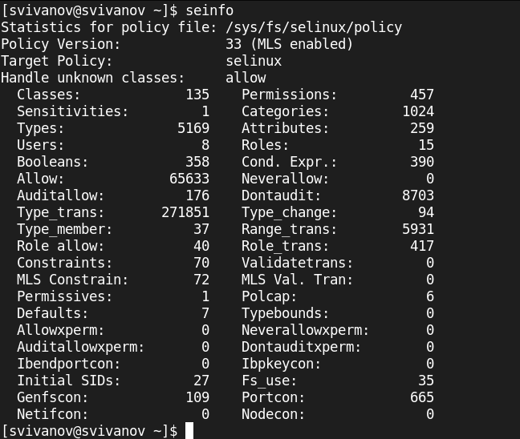{#fig:005 width=70%}
 
Определим тип файлов и поддиректорий, находящихся в директории
/var/www, с помощью команды
ls -lZ /var/www.
Файлов 0, 2 поддиректории, владелец - root (рис. 6).

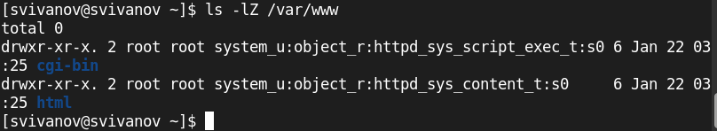{#fig:006 width=70%}

Определим тип файлов, находящихся в директории /var/www/html:
ls -lZ /var/www/html.
Файлов нет (рис. 7). 

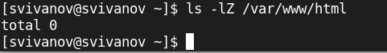{#fig:007 width=70%}

Создадим от имени суперпользователя html-файл
/var/www/html/test.html следующего содержания: (рис. 8). 
```html
<html>
  <body>test</body>
</html>. 
```

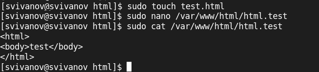{#fig:008 width=70%}

Проверим контекст созданного файла. Контекст - httpd_sys_content_d (рис. 9).

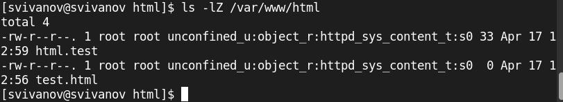{#fig:009 width=70%}

Обратитимся к файлу через веб-сервер, введя в браузере адрес
http://127.0.0.1/test.html. Убедимся, что файл был успешно отображён. (рис. 10). 

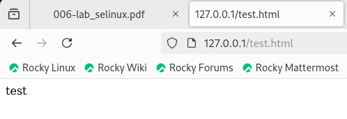{#fig:010 width=70%}

Изучим справку man httpd_selinux. Так
как по умолчанию пользователи CentOS являются свободными от типа
(unconfined в переводе с англ. свободный), созданному нами
файлу test.html был сопоставлен SELinux, пользователь unconfined_u.
Это первая часть контекста.
Далее политика ролевого разделения доступа RBAC используется процессами, но не файлами, поэтому роли не имеют никакого значения для
файлов. Роль object_r используется по умолчанию для файлов на «постоянных» носителях и на сетевых файловых системах. (В директории
/ргос файлы, относящиеся к процессам, могут иметь роль system_r.
Если активна политика MLS, то могут использоваться и другие роли,
например, secadm_r. Данный случай мы рассматривать не будем, как и
предназначение :s0).
Тип httpd_sys_content_t позволяет процессу httpd получить доступ к файлу. Благодаря наличию последнего типа мы получили доступ к файлу
при обращении к нему через браузер. (рис. 11). 

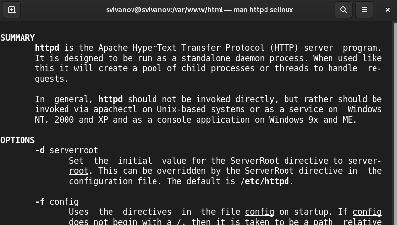{#fig:011 width=70%}

Изменим контекст файла /var/www/html/test.html с
httpd_sys_content_t, например, на samba_share_t:
chcon -t samba_share_t /var/www/html/test.html
ls -Z /var/www/html/test.html (рис. 12). 

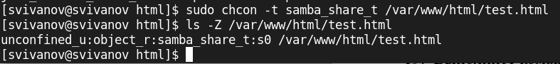{#fig:012 width=70%}

Попробуем ещё раз получить доступ к файлу через веб-сервер, введя в
браузере адрес http://127.0.0.1/test.html. Мы получили
сообщение об ошибке: (рис. 13). 

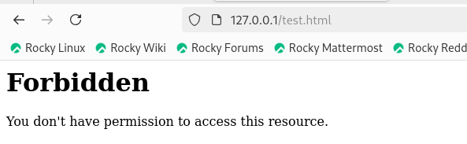{#fig:013 width=70%}

Файл не был отображен потому что мы установили контекст, к котрому процесс httpd не имеет доступа. 
Просмотрим log-файлы веб-сервера Apache. Также просмотрим системный лог-файл:
tail /var/log/messages. (рис. 14)

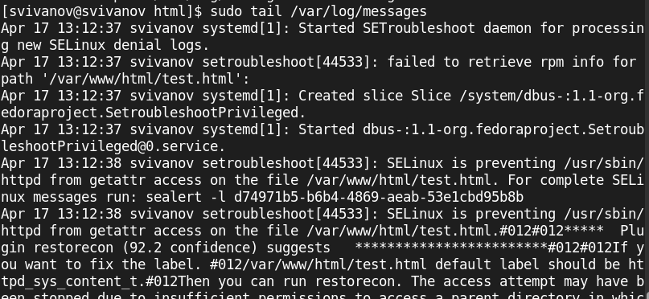{#fig:014 width=70%}

Попробуем запустить веб-сервер Apache на прослушивание ТСР-порта 81. Для
этого в файле /etc/httpd/httpd.conf найдем строчку Listen 80 и
заменим её на Listen 81. (рис. 15)

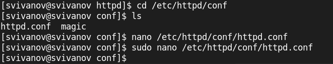{#fig:015 width=70%}

Изменение порта (рис. 16)

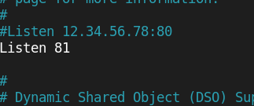{#fig:016 width=70%}

Выполним перезапуск веб-сервера Apache. Произошёл сбой, потому что порт 81 не добавлен в список прослушиваемых портов (рис. 17)

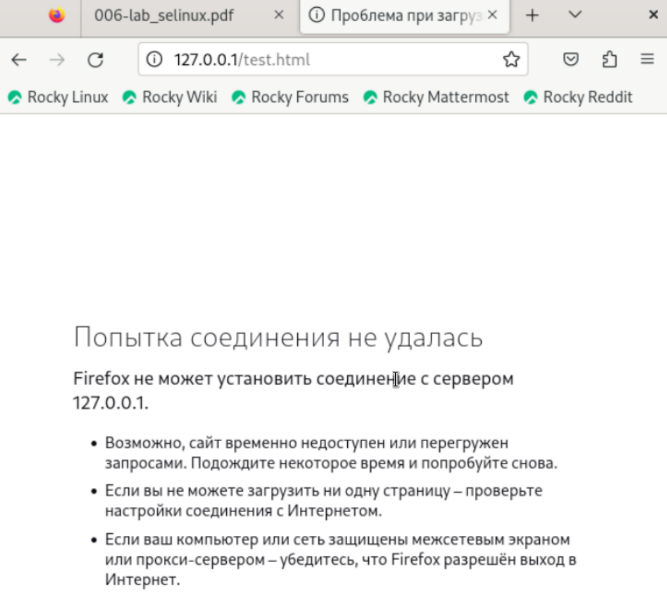{#fig:017 width=70%}

Проанализируем лог-файлы:
tail -nl /var/log/messages (рис. 18)

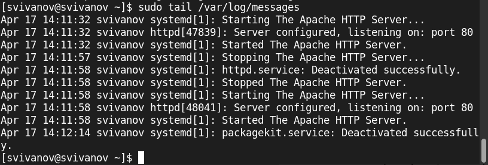{#fig:018 width=70%}

Просмотрим файлы /var/log/http/error_log,
/var/log/http/access_log и /var/log/audit/audit.log. 
Записи появились в файле error_log (рис. 19)

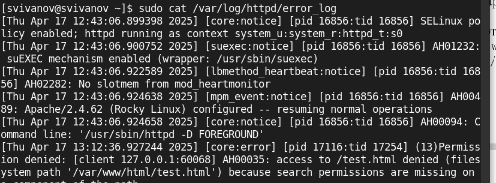{#fig:019 width=70%}

Выполним команду
semanage port -a -t http_port_t -р tcp 81
После этого проверим список портов командой
semanage port -l | grep http_port_t (рис. 20)

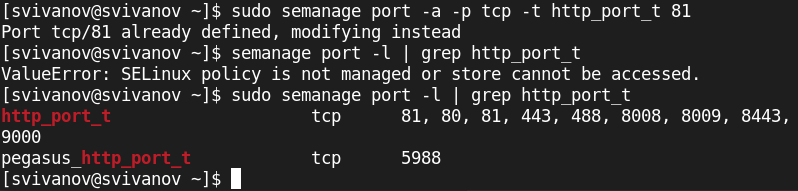{#fig:020 width=70%}

Попробуем запустить веб-сервер Apache ещё раз. 
Вернем контекст httpd_sys_cоntent__t к файлу /var/www/html/ test.html:
chcon -t httpd_sys_content_t /var/www/html/test.html. (рис. 21)

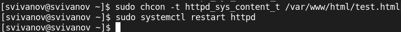{#fig:021 width=70%}

Сервер запустился, т.к порт 81 теперь прослушивается. (рис. 22)

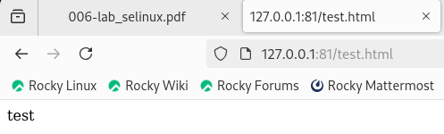{#fig:022 width=70%}

Исправим обратно конфигурационный файл apache, вернув Listen 80.
Удалим привязку http_port_t к 81 порту:
semanage port -d -t http_port_t -p tcp 81
и проверим, что порт 81 удалён. (рис. 23)

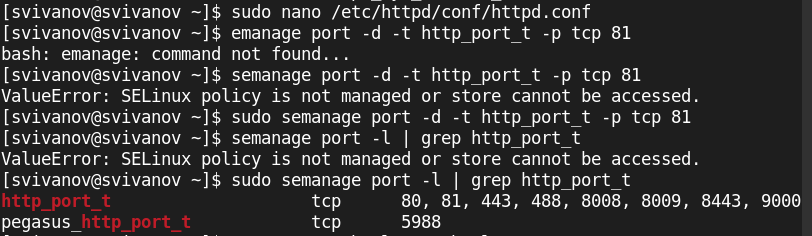{#fig:023 width=70%}

Удалим файл /var/www/html/test.html:
rm /var/www/html/test.html. (рис. 24)

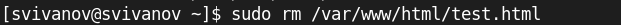{#fig:024 width=70%}

# Вывод

В ходе работы были развиты навыки администрирования ОС Linux. Получено первое практическое знакомство с технологией SELinux.
Проверена работу SELinx на практике совместно с веб-сервером Apache.

