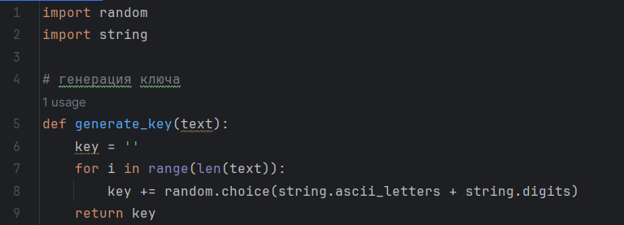
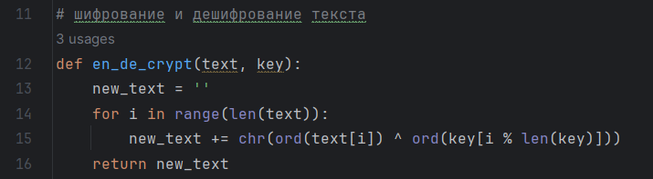
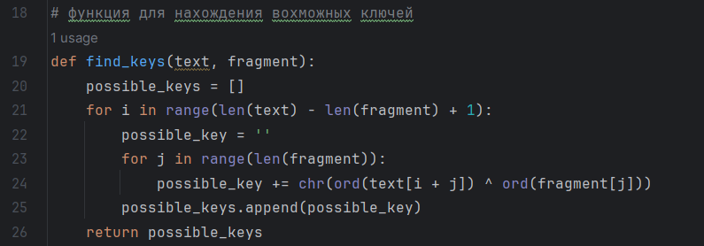
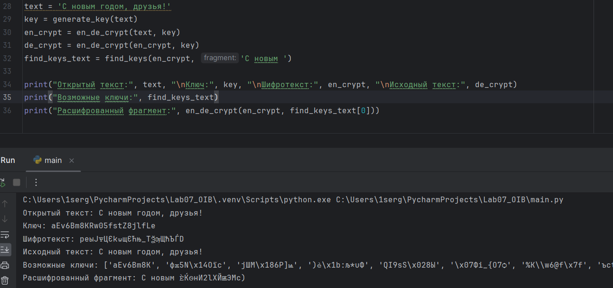

---
## Front matter
lang: ru-RU
title: Лабораторная работа №7
subtitle: Основы информационной безопасности
author:
  - Иванов Сергей Владимирович, НПИбд-01-23
institute:
  - Российский университет дружбы народов, Москва, Россия
date: 8 мая 2025

## i18n babel
babel-lang: russian
babel-otherlangs: english

## Formatting pdf
toc: false
slide_level: 2
aspectratio: 169
section-titles: true
theme: metropolis
header-includes:
 - \metroset{progressbar=frametitle,sectionpage=progressbar,numbering=fraction}
 - '\makeatletter'
 - '\beamer@ignorenonframefalse'
 - '\makeatother'

 ## Fonts
mainfont: PT Serif
romanfont: PT Serif
sansfont: PT Sans
monofont: PT Mono
mainfontoptions: Ligatures=TeX
romanfontoptions: Ligatures=TeX
sansfontoptions: Ligatures=TeX,Scale=MatchLowercase
monofontoptions: Scale=MatchLowercase,Scale=0.9
---

## Цель работы

Освоить на практике применение режима однократного гаммирования.

## Задание

1. Определить вид шифротекста при известном ключе и известном открытом тексте.

2. Определить ключ, с помощью которого шифротекст может быть преобразован в некоторый фрагмент текста, представляющий собой один из
возможных вариантов прочтения открытого текста.

# Выполнение работы

## Функция генерации ключа

Для начала напишем функцию для генерации случайного ключа (рис. 1)

{#fig:001 width=70%}

## Функция шифрования и дешифрования

Пишу функцию для шифровнаия и дешифрования текста. (рис. 2).

{#fig:002 width=70%}

## Поиск возможных ключей

Пишу функцию для поиска возможных ключей для фрагмента текста (рис. 3).

{#fig:003 width=70%}

## Проверка работы программы

Проверяем всех функций. Убеждаемся, все работает корректно. (рис. 4).

{#fig:004 width=70%}

# Вывод

## Вывод 

В ходе выполнения лабораторной работы мной было освоено на практике применение режима однократного гаммирования.

 
