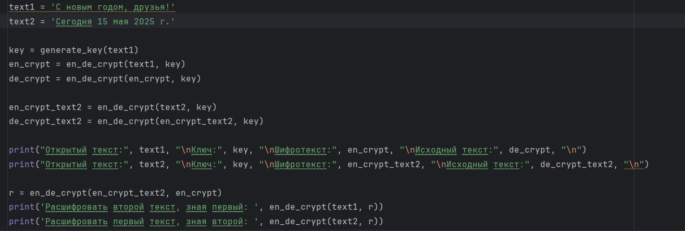
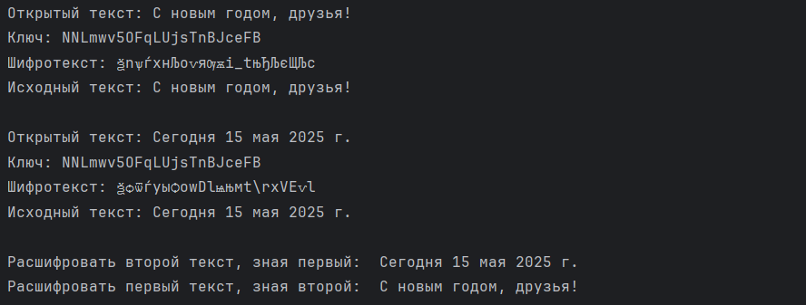

---
## Front matter
title: "Отчет по лабораторной работе №8"
subtitle: "Дисциплина: Основы информационной безопасности"
author: "Иванов Сергей Владимирович"

## Generic otions
lang: ru-RU
toc-title: "Содержание"

## Bibliography
bibliography: bib/cite.bib
csl: pandoc/csl/gost-r-7-0-5-2008-numeric.csl

## Pdf output format
toc: true # Table of contents
toc-depth: 2
lof: true # List of figures
fontsize: 12pt
linestretch: 1.5
papersize: a4
documentclass: scrreprt
## I18n polyglossia
polyglossia-lang:
  name: russian
  options:
	- spelling=modern
	- babelshorthands=true
polyglossia-otherlangs:
  name: english
## I18n babel
babel-lang: russian
babel-otherlangs: english
## Fonts
mainfont: PT Serif
romanfont: PT Serif
sansfont: PT Sans
monofont: PT Mono
mainfontoptions: Ligatures=TeX
romanfontoptions: Ligatures=TeX
sansfontoptions: Ligatures=TeX,Scale=MatchLowercase
monofontoptions: Scale=MatchLowercase,Scale=0.9
## Biblatex
biblatex: true
biblio-style: "gost-numeric"
biblatexoptions:
  - parentracker=true
  - backend=biber
  - hyperref=auto
  - language=auto
  - autolang=other*
  - citestyle=gost-numeric
## Pandoc-crossref LaTeX customization
figureTitle: "Рис."
listingTitle: "Листинг"
lofTitle: "Список иллюстраций"
lolTitle: "Листинги"
## Misc options
indent: true
header-includes:
  - \usepackage{indentfirst}
  - \usepackage{float} # keep figures where there are in the text
  - \floatplacement{figure}{H} # keep figures where there are in the text
---

# Цель работы

Освоить на практике применение режима однократного гаммирования
на примере кодирования различных исходных текстов одним ключом

# Задание

Два текста кодируются одним ключом (однократное гаммирование).
Требуется не зная ключа и не стремясь его определить, прочитать оба текста. Необходимо разработать приложение, позволяющее шифровать и дешифровать тексты $P_1$ и $P_2$ в режиме однократного гаммирования. Приложение должно определить вид шифротекстов $C_1$ и $C_2$ обоих текстов $P_1$ и
P2 при известном ключе; Необходимо определить и выразить аналитически способ, при котором злоумышленник может прочитать оба текста, не
зная ключа и не стремясь его определить.

# Выполнение лабораторной работы

Я выполнял работу на языке программирования Python, используя функции, реализованные в лабораторной работе №7.

Используя функцию для генерации ключа, генерирую ключ, затем шифрую два разных текста одним и тем же ключом (рис. 1).

{#fig:001 width=70%}

Расшифровываю оба текста сначала с помощью одного ключа, затем предполагаю, что мне неизвестен ключ, но извествен один из текстов и уже расшифровываю второй, зная шифротексты и первый текст (рис. 2).

{#fig:002 width=70%}

Листинг программы 1
```python

import random
import string

# генерация ключа
def generate_key(text):
    key = ''
    for i in range(len(text)):
        key += random.choice(string.ascii_letters + string.digits)
    return key

# шифрование и дешифрование текста
def en_de_crypt(text, key):
    new_text = ''
    for i in range(len(text)):
        new_text += chr(ord(text[i]) ^ ord(key[i % len(key)]))
    return new_text

# функция для нахождения возможных ключей
def find_keys(text, fragment):
    possible_keys = []
    for i in range(len(text) - len(fragment) + 1):
        possible_key = ''
        for j in range(len(fragment)):
            possible_key += chr(ord(text[i + j]) ^ ord(fragment[j]))
        possible_keys.append(possible_key)
    return possible_keys

text1 = 'С новым годом, друзья!'
text2 = 'Сегодня 15 мая 2025 г.'

key = generate_key(text1)
en_crypt = en_de_crypt(text1, key)
de_crypt = en_de_crypt(en_crypt, key)

en_crypt_text2 = en_de_crypt(text2, key)
de_crypt_text2 = en_de_crypt(en_crypt_text2, key)

print("Открытый текст:", text1, "\nКлюч:", key, "\nШифротекст:", en_crypt, "\nИсходный текст:", de_crypt, "\n")
print("Открытый текст:", text2, "\nКлюч:", key, "\nШифротекст:", en_crypt_text2, "\nИсходный текст:", de_crypt_text2, "\n")

r = en_de_crypt(en_crypt_text2, en_crypt)
print('Расшифровать второй текст, зная первый: ', en_de_crypt(text1, r))
print('Расшифровать первый текст, зная второй: ', en_de_crypt(text2, r))
```

# Ответы на контрольные вопросы

1. Как, зная один из текстов ($P_1$ или $P_2$), определить другой, не зная при
этом ключа? - Для определения другого текста ($P_2$) можно просто взять зашифрованные тексты $C_1 ⊕ C_2$, далее применить XOR к ним и к известному тексту: $C_1 ⊕ C_2 ⊕ P_1 = P_2$.

2. Что будет при повторном использовании ключа при шифровании текста? - При повторном использовании ключа мы получим дешифрованный текст.

3. Как реализуется режим шифрования однократного гаммирования одним ключом двух открытых текстов? - Режим шифрования однократного гаммирования одним ключом двух открытых текстов осуществляется путем XOR-ирования каждого бита первого текста с соответствующим битом ключа или второго текста.

4. Перечислите недостатки шифрования одним ключом двух открытых текстов - Недостатки шифрования одним ключом двух открытых текстов включают возможность раскрытия ключа или текстов при известном открытом тексте.

5. Перечислите преимущества шифрования одним ключом двух открытых текстов - Преимущества шифрования одним ключом двух открытых текстов включают использование одного ключа для зашифрования нескольких сообщений без необходимости создания нового ключа и выделения на него памяти.

# Выводы

В ходе лабораторной работы были освоины на практике навыки применения режима однократного гаммирования на примере кодирования различных исходных текстов одним ключом.

