---
## Front matter
lang: ru-RU
title: Индивидуальный проект. Этап 1
subtitle: Основы информационной безопасности
author:
  - Иванов Сергей Владимирович, НПИбд-01-23
institute:
  - Российский университет дружбы народов, Москва, Россия
date: 20 февраля 2025

## i18n babel
babel-lang: russian
babel-otherlangs: english

## Formatting pdf
toc: false
slide_level: 2
aspectratio: 169
section-titles: true
theme: metropolis
header-includes:
 - \metroset{progressbar=frametitle,sectionpage=progressbar,numbering=fraction}
 - '\makeatletter'
 - '\beamer@ignorenonframefalse'
 - '\makeatother'

  ## Fonts
mainfont: PT Serif
romanfont: PT Serif
sansfont: PT Sans
monofont: PT Mono
mainfontoptions: Ligatures=TeX
romanfontoptions: Ligatures=TeX
sansfontoptions: Ligatures=TeX,Scale=MatchLowercase
monofontoptions: Scale=MatchLowercase,Scale=0.9
---

## Цель работы

Приобретение практических навыков по установке операционной системы Linux на виртуальную машину.

## Задание

1. Установить дистрибутив Kali Linux на виртуальную машину VirtualBox.

# Выполнение работы

## Выбор имени машины

Открываю VirtualBox, нажимаю `создать`, в окне выбираю задаю имя машины, подключаю образ ISO. 

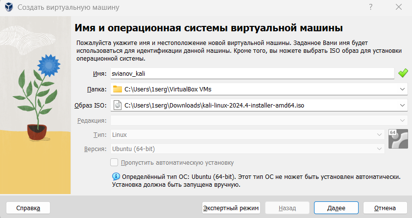{#fig:001 width=70%}

## Настройка оборудования

Настраиваю количество ОЗУ и ЦП, нажимаю далее. 

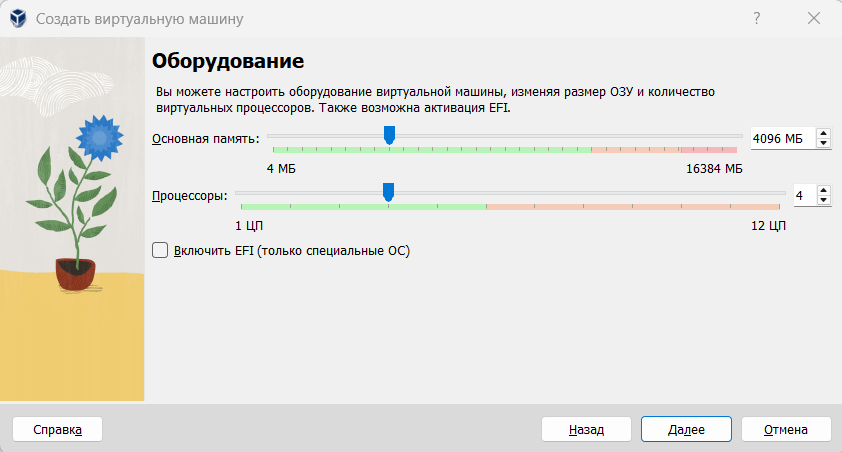{#fig:002 width=70%}

## Настройка диска

Настраиваю размер виртуального жесткого диска, задаю ему 40гб. 

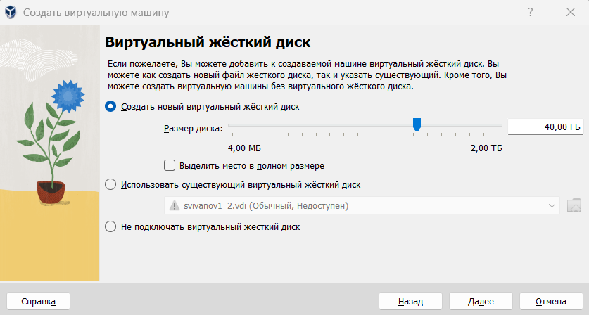{#fig:003 width=70%}

## Запуск машины

Запускаем виртуальную машину, выбираем графическую установку 

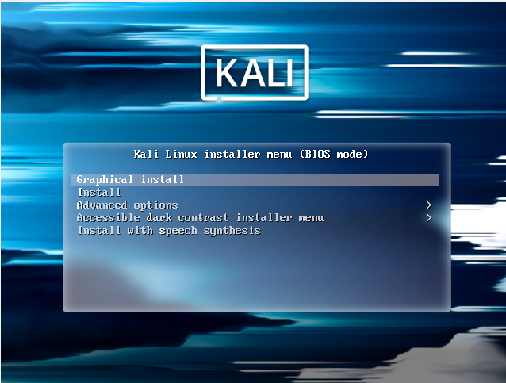{#fig:004 width=70%}

## Язык установки

Далее выбираю язык установки. 

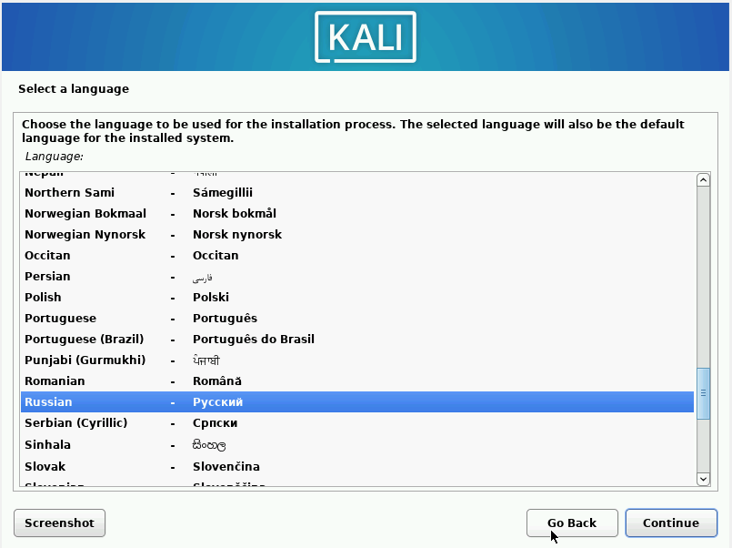{#fig:005 width=70%}

## Выбор местонахождения

Выбираю местонахождение, Российская Федерация.

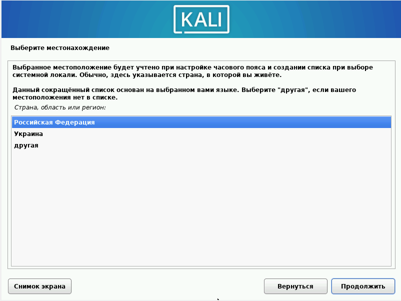{#fig:006 width=70%}

## Выбор раскладки

Выбираю раскладку клавиатуры. 

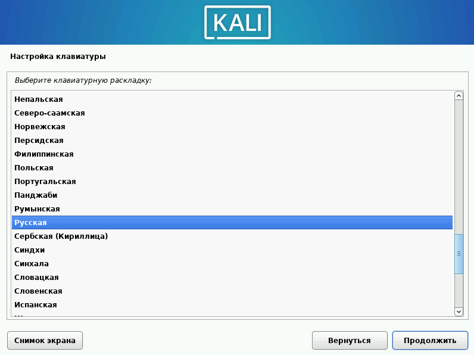{#fig:007 width=70%}

## Способ переключения раскладки

Выбираем способ переключения раскладки клавиатуры.

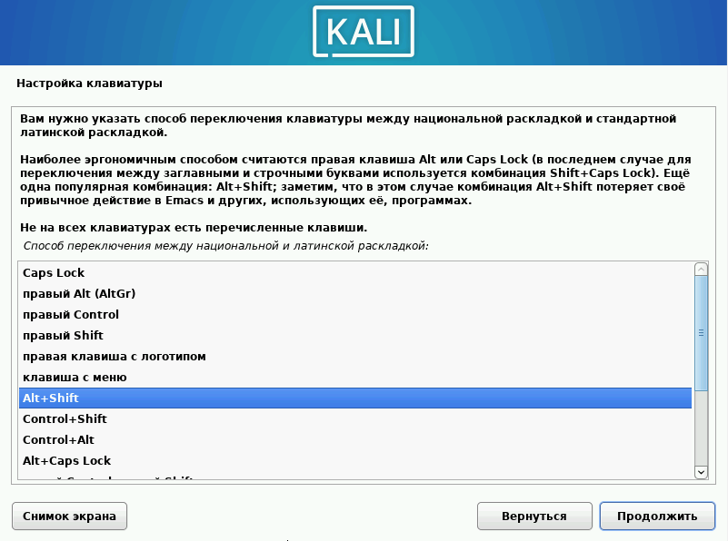{#fig:008 width=70%}

## Имя компьютера

Вводим имя компьютера. 

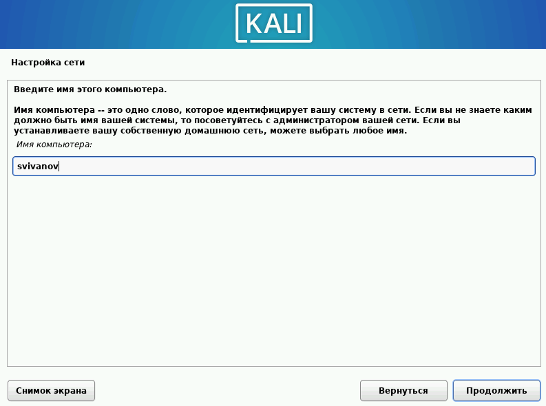{#fig:009 width=70%}

## Имя домена

Ввожу имя домена. 

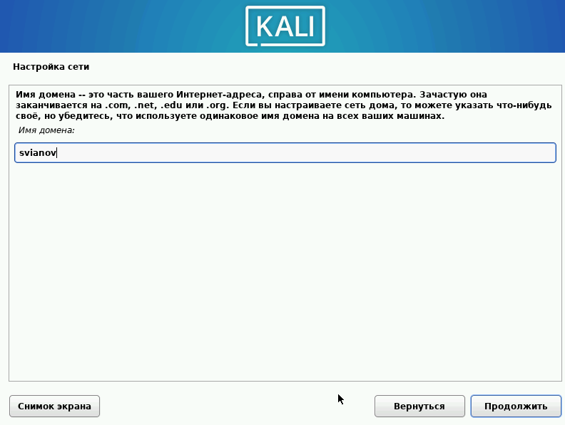{#fig:010 width=70%}

## Настройка учетной записи

Ввожу имя пользователя, у которого будут права суперпользователя.

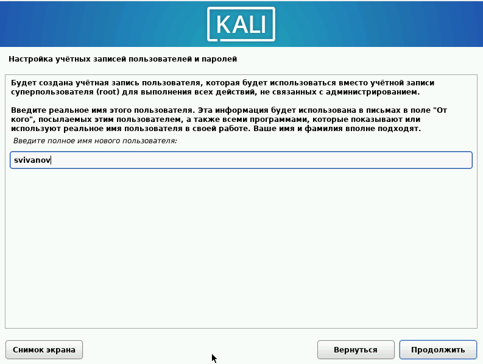{#fig:011 width=70%}

## Настройка учетной записи

Выбираем это же имя как имя моей учетной записи. 

{#fig:012 width=70%}

## Настройка учетной записи

Ввожу пароль учетной записи. 

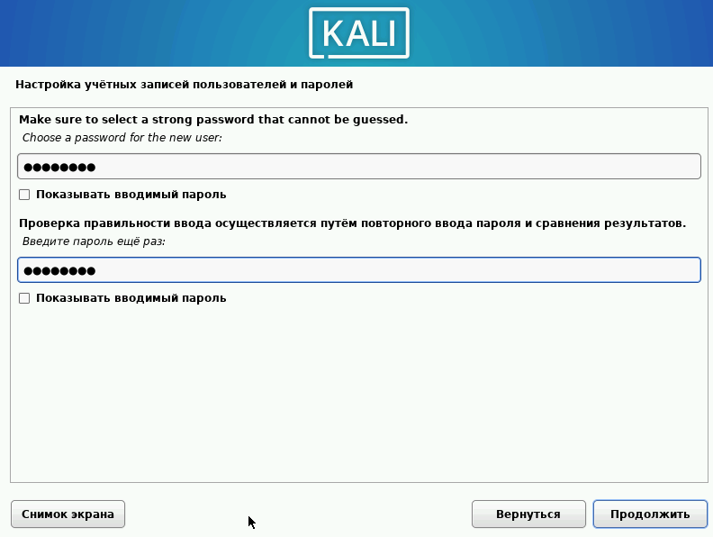{#fig:013 width=70%}

## Часовой пояс

Выбираю часовой пояс. 

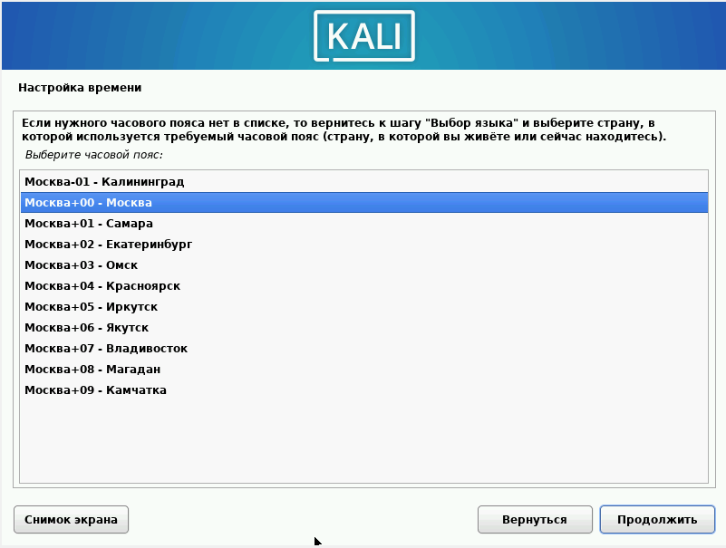{#fig:014 width=70%}

## Разметка дисков

Размечаю диск. Выбриаю Авто - использовать весь диск. 

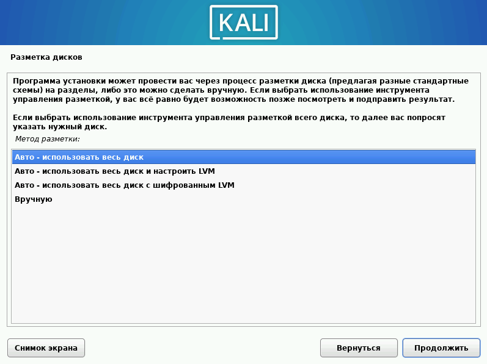{#fig:015 width=70%}

## Разметка дисков

Убеждаюсь, что выбран нужный виртуальный жесткий дис. 

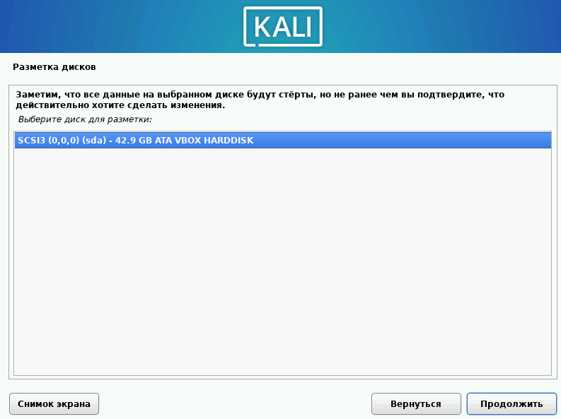{#fig:016 width=70%}

## Разметка дисков

Выбираю схему разметки. Оставляю по умолчанию. 

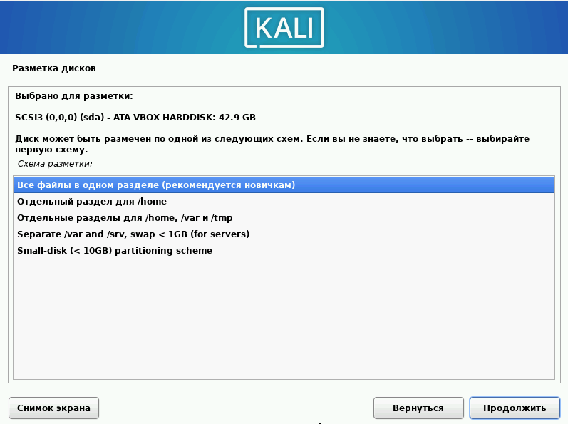{#fig:017 width=70%}

## Разметка дисков

Подтвердаю разметку дисков и записываю изменения. 

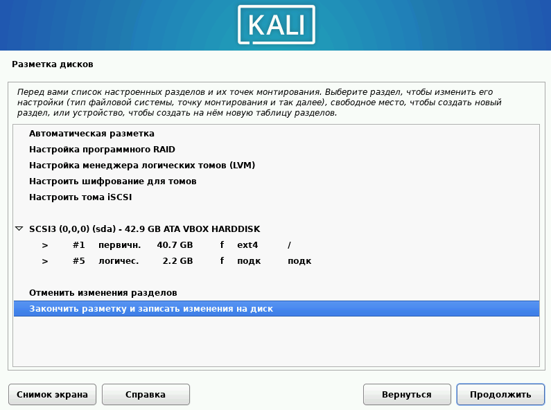{#fig:018 width=70%}

## Запись изменений 

Записываю изменения на диск. 

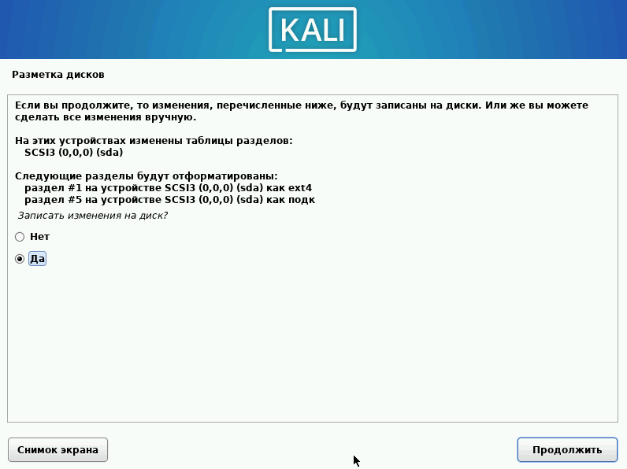{#fig:019 width=70%}

## Выбор программного обеспечения

Выбираю программное обеспечние, которое будет установлено. Оставляю все по умолчанию. 

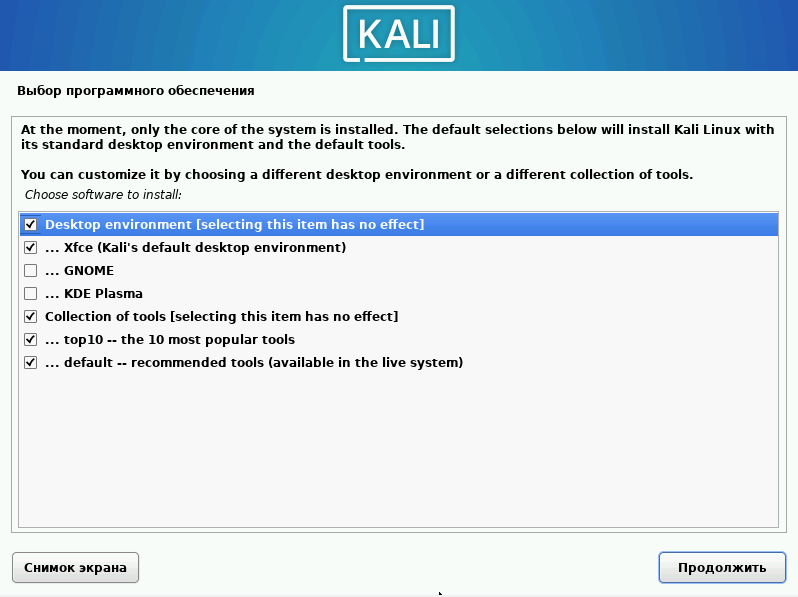{#fig:020 width=70%}

## Системный загрузчик

Подтверждаю установку системного загрузчика GRUB. После чего начинается установка ОС. 

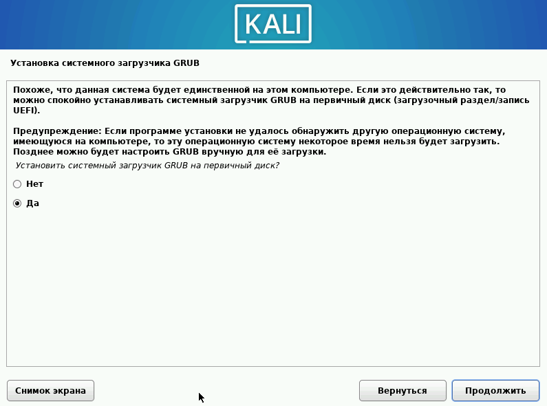{#fig:021 width=70%}

## Завершение установки 

Установка завершилась. Перезапускаем машину. 

{#fig:022 width=70%}

## Вход в систему

Вхожу в систему от имени своего пользователя. 

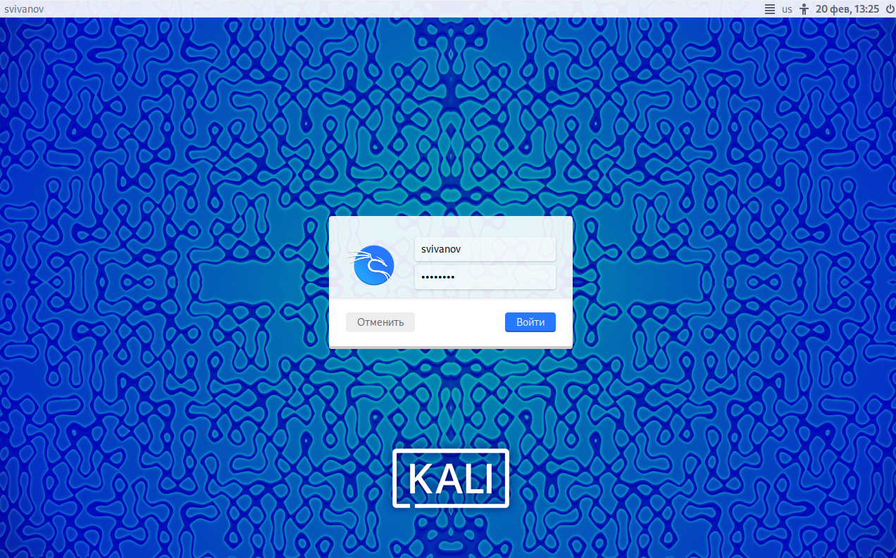{#fig:023 width=70%}

## Успешный вход 

Вход в систему выполнен успешно. 

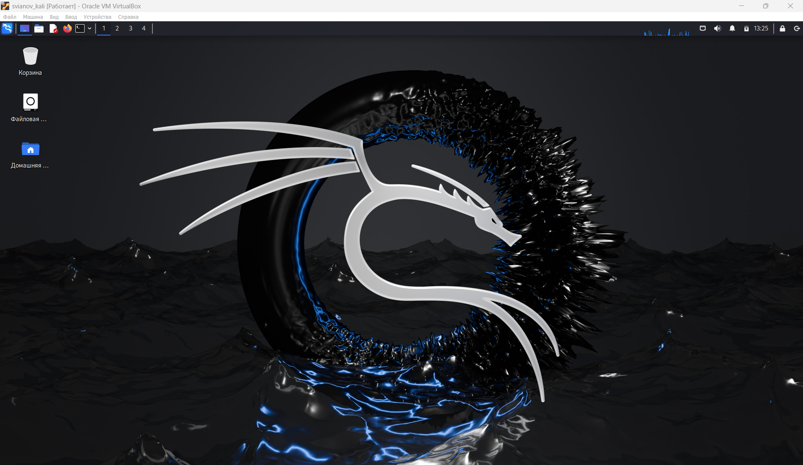{#fig:024 width=70%}

# Вывод

## Вывод 

Приобрёл практические навыки по установке операционной системы Linux на виртуальную машину. Установил дистрибутив Kali LInux на VirtualBox.

