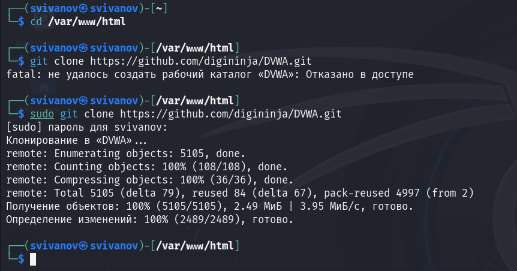
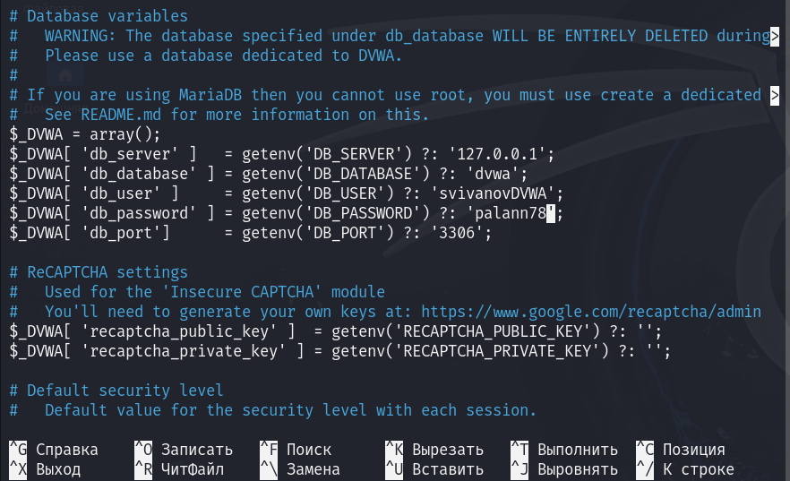
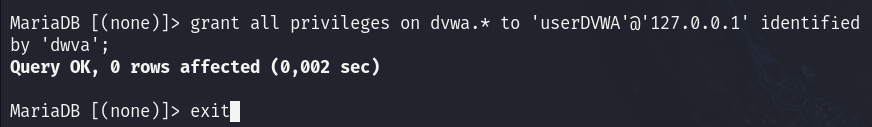
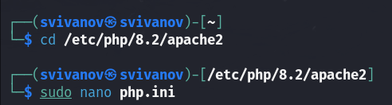
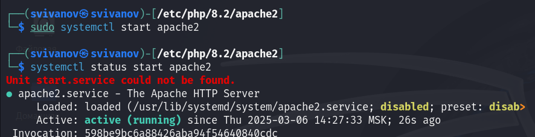
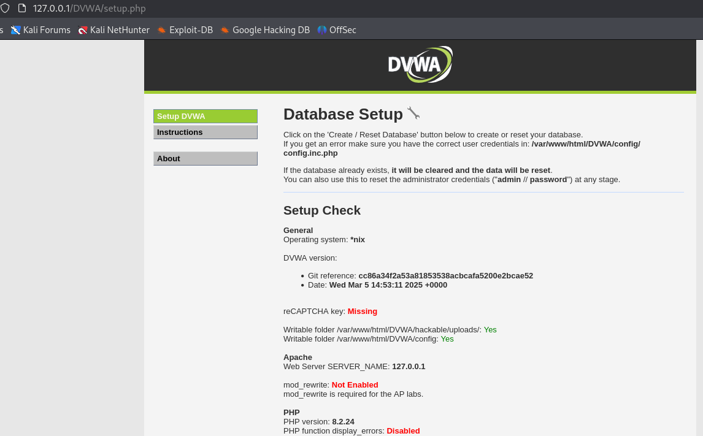
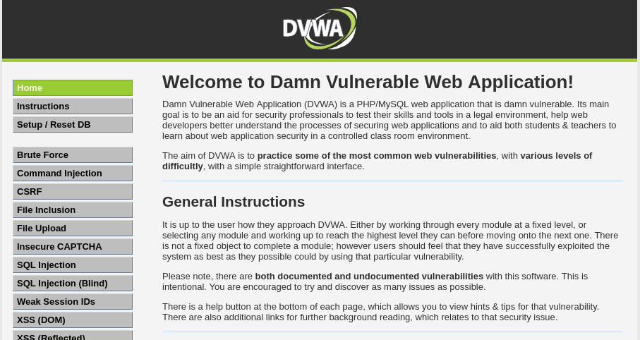

---
## Front matter
lang: ru-RU
title: Индивидуальный проект. Этап 2
subtitle: Основы информационной безопасности
author:
  - Иванов Сергей Владимирович, НПИбд-01-23
institute:
  - Российский университет дружбы народов, Москва, Россия
date: 7 марта 2025

## i18n babel
babel-lang: russian
babel-otherlangs: english

## Formatting pdf
toc: false
slide_level: 2
aspectratio: 169
section-titles: true
theme: metropolis
header-includes:
 - \metroset{progressbar=frametitle,sectionpage=progressbar,numbering=fraction}
 - '\makeatletter'
 - '\beamer@ignorenonframefalse'
 - '\makeatother'

  ## Fonts
mainfont: PT Serif
romanfont: PT Serif
sansfont: PT Sans
monofont: PT Mono
mainfontoptions: Ligatures=TeX
romanfontoptions: Ligatures=TeX
sansfontoptions: Ligatures=TeX,Scale=MatchLowercase
monofontoptions: Scale=MatchLowercase,Scale=0.9
---

## Цель работы

Установить и настроить DVWA на Kali Linux.

## Задание

1. Установить DVWA в гостевую систему к Kali Linux.

# Выполнение работы

## Клонирование репозитория

Переходим в директорию var/www/html. Затем клонируем нужный репозиторий GitHub. (рис. 1).

{#fig:001 width=70%}

## Повышение прав доступа

Проверяю директорию и повышаю права доступа до 777. (рис. 2)

{#fig:002 width=70%}

## Переход по каталогу и проверка

Перехожу в каталог DVWA/config и проверяю содержимое. (рис. 3)

{#fig:003 width=70%}

## Открытие файла в редакторе

Далее открываю файл конфигурации в текстовом редакторе. (рис. 4)

{#fig:004 width=70%}

## Редактирование файла

Редактирую данные о логине и пароле. (рис. 5)

{#fig:005 width=70%}

## Запуск mysql

Запускаю службу mysql и проверяю статус. (рис. 6)

{#fig:006 width=70%}

## Авторизация в базе данных

Авторизуюсь в бвзе данных от имени пользователя root. Создаем в ней нового пользователя. (рис. 7)

{#fig:007 width=70%}

## Предоставление привелегий

Предоставляю пользователю привелегии для работы с этой базой данных. (рис. 8)

{#fig:008 width=70%}

## Перемещение по директориям

Необходимо настроить сервер apache2. Перехожу в нужную директорию и открываю файл. (рис. 9)

{#fig:009 width=70%}

## Редактирование файла

Редактирую 2 параметра. (рис. 10)

{#fig:010 width=70%}

## Запуск и проверка статуса

Запускаю веб-сервер apache2 и проверяю его статус. (рис. 11)

{#fig:011 width=70%}

## Запуск веб-приложения

Открываю браузер и запускаю веб-приложение, введя 127.0.0.1/DVWA . (рис. 12)

{#fig:012 width=70%}

## Создание базы

Прокручиваю страницу вниз и нажимаю кнопку create/reset database. (рис. 13)

{#fig:013 width=70%}

## Авторизация

Авторизуюсь с помощью предложенных данных по умолчанию. (рис. 14)

{#fig:014 width=70%}

## Завершение установки

Мы оказались на домашней странице веб-приложения. Установка завершена. (рис. 15)

{#fig:015 width=70%}

# Вывод

## Вывод 

Приобретены навыки по установке веб-приложения DVWA на гостевую систему Kali Linux.

