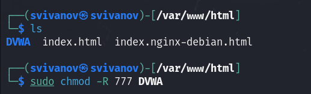
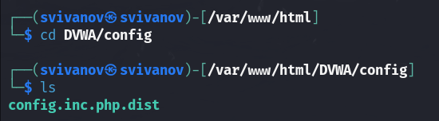
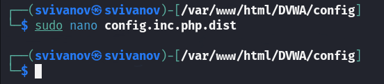
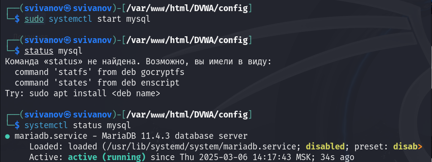
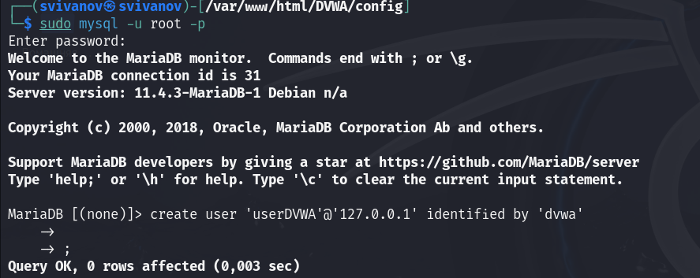
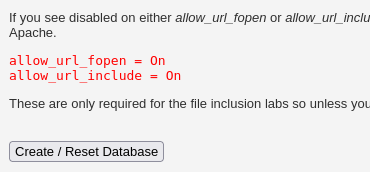
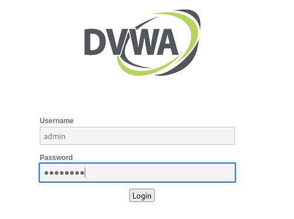

---
## Front matter
title: "Отчет по второму этапу индивидуального проекта"
subtitle: "Дисциплина: Основы информационной безопасности"
author: "Иванов Сергей Владимирович, НПИбд-01-23"

## Generic otions
lang: ru-RU
toc-title: "Содержание"

## Bibliography
bibliography: bib/cite.bib
csl: pandoc/csl/gost-r-7-0-5-2008-numeric.csl

## Pdf output format
toc: true # Table of contents
toc-depth: 2
lof: true # List of figures
fontsize: 12pt
linestretch: 1.5
papersize: a4
documentclass: scrreprt
## I18n polyglossia
polyglossia-lang:
  name: russian
  options:
	- spelling=modern
	- babelshorthands=true
polyglossia-otherlangs:
  name: english
## I18n babel
babel-lang: russian
babel-otherlangs: english
## Fonts
mainfont: PT Serif
romanfont: PT Serif
sansfont: PT Sans
monofont: PT Mono
mainfontoptions: Ligatures=TeX
romanfontoptions: Ligatures=TeX
sansfontoptions: Ligatures=TeX,Scale=MatchLowercase
monofontoptions: Scale=MatchLowercase,Scale=0.9
## Biblatex
biblatex: true
biblio-style: "gost-numeric"
biblatexoptions:
  - parentracker=true
  - backend=biber
  - hyperref=auto
  - language=auto
  - autolang=other*
  - citestyle=gost-numeric
## Pandoc-crossref LaTeX customization
figureTitle: "Рис."
listingTitle: "Листинг"
lofTitle: "Список иллюстраций"
lolTitle: "Листинги"
## Misc options
indent: true
header-includes:
  - \usepackage{indentfirst}
  - \usepackage{float} # keep figures where there are in the text
  - \floatplacement{figure}{H} # keep figures where there are in the text
---

# Цель работы

Установить и настроить DVWA на Kali Linux.

# Задание

1. Установить DVWA в гостевую систему к Kali Linux.

# Выполнение лабораторной работы

Переходим в директорию var/www/html. Затем клонируем нужный репозиторий GitHub. (рис. 1).

{#fig:001 width=70%}

Проверяю директорию и повышаю права доступа до 777. (рис. 2)

{#fig:002 width=70%}

Перехожу в каталог DVWA/config и проверяю содержимое. (рис. 3)

{#fig:003 width=70%}

Далее открываю файл конфигурации в текстовом редакторе. (рис. 4)

{#fig:004 width=70%}

Редактирую данные о логине и пароле. (рис. 5)

{#fig:005 width=70%}

Запускаю службу mysql и проверяю статус. (рис. 6)

{#fig:006 width=70%}

Авторизуюсь в бвзе данных от имени пользователя root. Создаем в ней нового пользователя. (рис. 7)

{#fig:007 width=70%}

Предоставляю пользователю привелегии для работы с этой базой данных. (рис. 8)

{#fig:008 width=70%}

Необходимо настроить сервер apache2. Перехожу в нужную директорию и открываю файл. (рис. 9)

{#fig:009 width=70%}

Редактирую 2 параметра. (рис. 10)

{#fig:010 width=70%}

Запускаю веб-сервер apache2 и проверяю его статус. (рис. 11)

{#fig:011 width=70%}

Открываю браузер и запускаю веб-приложение, введя 127.0.0.1/DVWA . (рис. 12)

{#fig:012 width=70%}

Прокручиваю страницу вниз и нажимаю кнопку create/reset database. (рис. 13)

{#fig:013 width=70%}

Авторизуюсь с помощью предложенных данных по умолчанию. (рис. 14)

{#fig:014 width=70%}

Мы оказались на домашней странице веб-приложения. Установка завершена. (рис. 15)

{#fig:015 width=70%}

# Выводы

Приобретены навыки по установке веб-приложения DVWA на гостевую систему Kali Linux.

