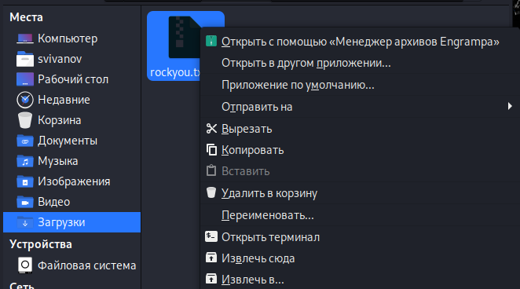
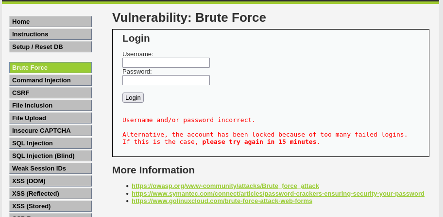
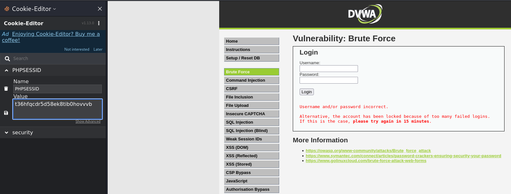
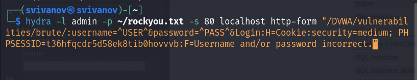
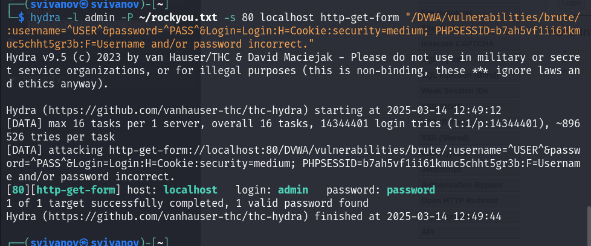
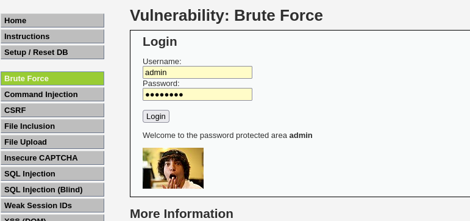

---
## Front matter
lang: ru-RU
title: Индивидуальный проект. Этап 3
subtitle: Основы информационной безопасности
author:
  - Иванов Сергей Владимирович, НПИбд-01-23
institute:
  - Российский университет дружбы народов, Москва, Россия
date: 14 марта 2025

## i18n babel
babel-lang: russian
babel-otherlangs: english

## Formatting pdf
toc: false
slide_level: 2
aspectratio: 169
section-titles: true
theme: metropolis
header-includes:
 - \metroset{progressbar=frametitle,sectionpage=progressbar,numbering=fraction}
 - '\makeatletter'
 - '\beamer@ignorenonframefalse'
 - '\makeatother'

  ## Fonts
mainfont: PT Serif
romanfont: PT Serif
sansfont: PT Sans
monofont: PT Mono
mainfontoptions: Ligatures=TeX
romanfontoptions: Ligatures=TeX
sansfontoptions: Ligatures=TeX,Scale=MatchLowercase
monofontoptions: Scale=MatchLowercase,Scale=0.9
---

## Цель работы

Получить практические навыки по использованию Hydra для брутфорса паролей.

## Задание

1. Взломать логин и пароль с помощью Hydra.

# Выполнение работы

## Распаковка архива с паролями

Для брутфорса паролей необходим список частоиспользуемых паролей. Использую стандартный список rockyou.txt для Kali Linux. Распаковываю его. (рис. 1).

{#fig:001 width=70%}

## Сайт DVWA

Захожу на сайт DVWA и перехожу во вкладку Brute Force. (рис. 2)

{#fig:002 width=70%}

## Получение параметров cookie

Необходимо получить параметры cookie с сайта. Использую специальное расширение. (рис. 3)

{#fig:003 width=70%}

## Запрос в Hydra

Далее ввожу запрос в Hydra. Подбираем пароль для пользователя admin, используем get запрос и параметры cookie. (рис. 4)

{#fig:004 width=70%}

## Результат запроса

Hedra выдала результат запроса. (рис. 5)

{#fig:005 width=70%}

## Результат

Вводим полученные логин и пароль на сайт. Видим, что авторизация выполнена успешно. (рис. 6)

{#fig:006 width=70%}

# Вывод

## Вывод 

Получены практические навыки по использованию Hydra для брутфорса паролей.

