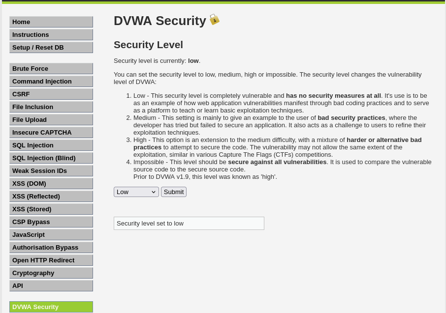
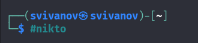
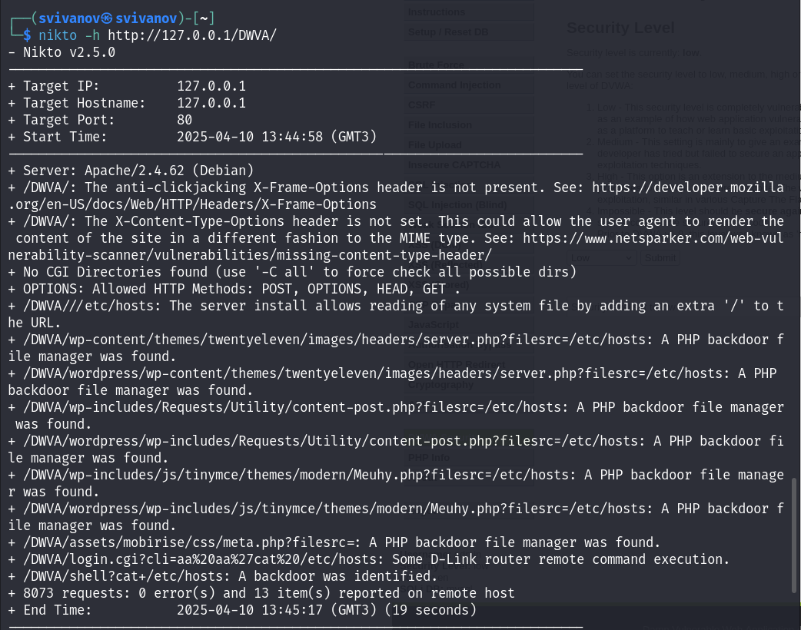
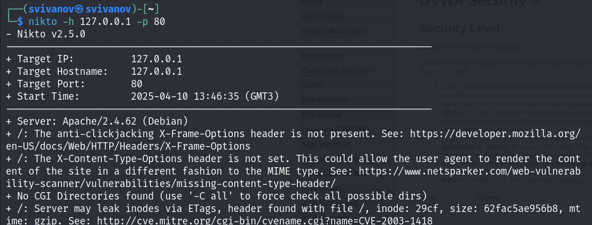

---
## Front matter
lang: ru-RU
title: Индивидуальный проект. Этап 4
subtitle: Основы информационной безопасности
author:
  - Иванов Сергей Владимирович, НПИбд-01-23
institute:
  - Российский университет дружбы народов, Москва, Россия
date: 10 апреля 2025

## i18n babel
babel-lang: russian
babel-otherlangs: english

## Formatting pdf
toc: false
slide_level: 2
aspectratio: 169
section-titles: true
theme: metropolis
header-includes:
 - \metroset{progressbar=frametitle,sectionpage=progressbar,numbering=fraction}
 - '\makeatletter'
 - '\beamer@ignorenonframefalse'
 - '\makeatother'

  ## Fonts
mainfont: PT Serif
romanfont: PT Serif
sansfont: PT Sans
monofont: PT Mono
mainfontoptions: Ligatures=TeX
romanfontoptions: Ligatures=TeX
sansfontoptions: Ligatures=TeX,Scale=MatchLowercase
monofontoptions: Scale=MatchLowercase,Scale=0.9
---

## Цель работы

Просканировать веб-приложение используя сканер nikto.

## Задание

1. Использовать nikto

# Выполнение работы

## Запуск DVWA

Для начала запустим веб приложение DVWA. Для этого необходимо запустить mysql и apache2. (рис. 1).

{#fig:001 width=70%}

## Выбор уровня безопасности

Захожу на сайт DVWA и перехожу во вкладку DWVA Security. Выбираю низкий уровень безопасности. (рис. 2)

{#fig:002 width=70%}

## Запуск nikto

Запускаю сканер nikto. (рис. 3)

{#fig:003 width=70%}

## Сканирование

Запускаю сканирование веб приложения вводя URL адрес. (рис. 4)

{#fig:004 width=70%}

## Сканирование

Запускаю сканирование вводя номер порта и адрес порта. (рис. 5)

{#fig:005 width=70%}

# Вывод

## Вывод 

Получены практические навыки по использованию nikto для сканирования веб приложений.

