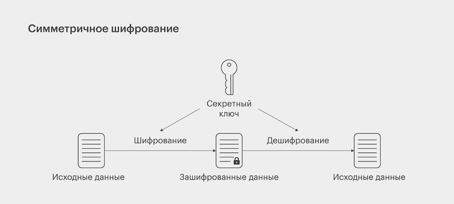
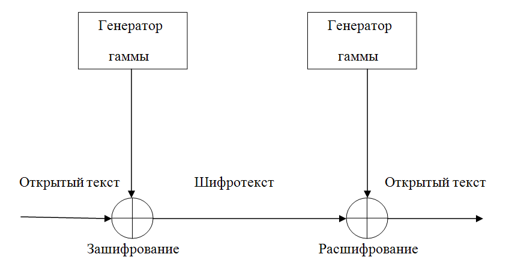
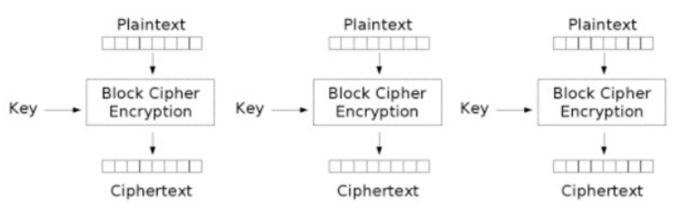

---
## Front matter
title: "Доклад"
subtitle: "Симметричные криптосистемы. Обзор, виды, применение."
author: "Иванов Сергей Владимирович"

## Generic otions
lang: ru-RU
toc-title: "Содержание"

## Bibliography
bibliography: bib/cite.bib
csl: pandoc/csl/gost-r-7-0-5-2008-numeric.csl

## Pdf output format
toc: true # Table of contents
toc-depth: 2
lof: true # List of figures
fontsize: 12pt
linestretch: 1.5
papersize: a4
documentclass: scrreprt
## I18n polyglossia
polyglossia-lang:
  name: russian
  options:
	- spelling=modern
	- babelshorthands=true
polyglossia-otherlangs:
  name: english
## I18n babel
babel-lang: russian
babel-otherlangs: english
## Fonts
mainfont: PT Serif
romanfont: PT Serif
sansfont: PT Sans
monofont: PT Mono
mainfontoptions: Ligatures=TeX,Scale=0.94
romanfontoptions: Ligatures=TeX,Scale=0.94
sansfontoptions: Ligatures=TeX,Scale=MatchLowercase,Scale=0.94
monofontoptions: Scale=MatchLowercase,Scale=0.94,FakeStretch=0.9
## Biblatex
biblatex: true
biblio-style: "gost-numeric"
biblatexoptions:
  - parentracker=true
  - backend=biber
  - hyperref=auto
  - language=auto
  - autolang=other*
  - citestyle=gost-numeric
## Pandoc-crossref LaTeX customization
figureTitle: "Рис."
listingTitle: "Листинг"
lofTitle: "Список иллюстраций"
lolTitle: "Листинги"
## Misc options
indent: true
header-includes:
  - \usepackage{indentfirst}
  - \usepackage{float} # keep figures where there are in the text
  - \floatplacement{figure}{H} # keep figures where there are in the text
---

# Введение

Шифрование - это процесс преобразования информации в непонятный для постороннего человека вид с помощью определенного алгоритма и ключа. Шифрование используется для защиты конфиденциальной информации от несанкционированного доступа и передачи ее по незащищенным каналам связи. Расшифровка сообщения возможна только при наличии правильного ключа. Существует множество методов шифрования, каждый из которых имеет свои преимущества и недостатки. Некоторые из них используются для защиты информации на уровне государственных секретов, в то время как другие могут быть использованы для защиты информации на уровне личной переписки.

Симметричное шифрование вплоть до семидесятых годов прошлого века, когда были созданы первые асимметричные шифры, по сути являлось единственным криптографическим методом. В общем и целом, симметричным может считаться любой шифр, который использует один и тот же секретный ключ для шифрования и расшифровки. К примеру, когда алгоритм подразумевает замену букв числами, то и передающая сообщение сторона, и принимающая должна иметь одну и ту же таблицу соответствия букв и чисел. Первая при ее помощи выполняет шифровку сообщения, а вторая это сообщение расшифровывает. 

Цель данного реферата — дать обзор симметричных криптосистем, рассмотреть их основные виды, принципы работы и области применения. В работе также будут затронуты достоинства и недостатки симметричного шифрования.

# Обзор симметричных криптосистем

Симметричное шифрование — это метод защиты информации, при котором один и тот же ключ используется как для шифрования, так и для расшифровки данных. Это означает, что отправитель и получатель должны заранее договориться об использовании одного общего ключа. Без этого ключа восстановить исходные данные практически невозможно.
Основной принцип работы симметричных алгоритмов заключается в преобразовании открытого текста в зашифрованный (так называемый шифртекст) с помощью криптографического ключа. Процесс расшифровки — это обратное преобразование, также с использованием того же ключа.

{#fig:001 width=70%}

Преимущества:

- Высокая скорость шифрования и дешифрования.
- Низкая вычислительная нагрузка на устройство.
- Простота реализации и стабильность алгоритмов.

Недостатки:

- Необходимость безопасного обмена ключом между сторонами.
- Один ключ на пару участников — что неудобно при большом количестве пользователей.
- Угрозы при перехвате ключа: весь обмен становится уязвимым.

Слабое место симметричного шифрования — обмен ключом. Поскольку для работы алгоритма ключ должен быть и у отправителя, и у получателя сообщения, его необходимо передать; однако при передаче по незащищенным каналам его могут перехватить и использовать посторонние. На практике во многих системах эта проблема решается шифрованием ключа с помощью асимметричного алгоритма.

Важным недостатком симметричных шифров является невозможность их использования в механизмах формирования электронной цифровой подписи и сертификатов, так как ключ известен каждой стороне.

Cовременные симметричные алгоритмы считаются надежными, если отвечают следующим требованиям:

- Выходные данные не должны содержать статистических паттернов исходных данных 
- Шифр должен быть нелинейным (то есть в шифрованных данных не должно быть закономерностей, которые можно отследить, имея на руках несколько открытых текстов и шифров к ним).

Большинство актуальных симметричных шифров для достижения результатов, соответствующих этим требованиям, используют комбинацию операций подстановки (замена фрагментов исходного сообщения, например букв, на другие данные, например цифры, по определенному правилу или с помощью таблицы соответствий) и перестановки (перемешивание частей исходного сообщения по определенному правилу), поочередно повторяя их. Один круг шифрования, состоящий из этих операций, называется раундом.

# Виды симметричной криптографии	

Симметричные криптосистемы делятся на два основных типа:

1. **Потоковые шифры** 

Потоковое шифрование данных предполагает обработку каждого бита информации с использованием гаммирования, то есть изменения этого бита с помощью соответствующего ему бита псевдослучайной секретной последовательности чисел, которая формируется на основе ключа и имеет ту же длину, что и шифруемое сообщение. Как правило, биты исходных данных сравниваются с битами секретной последовательности с помощью логической операции XOR (исключающее ИЛИ, на выходе дающее 0, если значения битов совпадают, и 1, если они различаются).

Потоковое шифрование в настоящее время используют следующие алгоритмы: RC4 (алгоритм шифрования с ключом переменной длины); SEAL (Software Efficient Algorithm, программно-эффективный алгоритм); WAKE (World Auto Key Encryption algorithm, алгоритм шифрования на автоматическом ключе)

{#fig:002 width=70%}

2. **Блочные шифры**

Блочные алгоритмы шифруют данные блоками фиксированной длины (64, 128 или другое количество бит в зависимости от алгоритма). Если все сообщение или его финальная часть меньше размера блока, система дополняет его предусмотренными алгоритмом символами, которые так и называются дополнением.

К актуальным блочным алгоритмам относятся: AES (англ. Advanced Encryption Standard) — американский стандарт шифрования; ГОСТ 28147-89 — советский и российский стандарт шифрования, также является стандартом СНГ; DES (англ. Data Encryption Standard) — стандарт шифрования данных в США; 3DES (Triple-DES, тройной DES); RC2 (Шифр Ривеста (Rivest Cipher или Ron’s Cipher))

{#fig:003 width=70%}

Большинство симметричных шифров используют сложную комбинацию большого количества подстановок и перестановок. Многие такие шифры исполняются в несколько (иногда до 80) проходов, используя на каждом проходе «ключ прохода». Множество «ключей прохода» для всех проходов называется «расписанием ключей» (key schedule). Как правило, оно создается из ключа выполнением над ним неких операций, в том числе перестановок и подстановок.

Типичным способом построения алгоритмов симметричного шифрования является сеть Фейстеля. Алгоритм строит схему шифрования на основе функции F(D, K), где D — порция данных размером вдвое меньше блока шифрования, а K — «ключ прохода» для данного прохода. От функции не требуется обратимость — обратная ей функция может быть неизвестна. Достоинства сети Фейстеля — почти полное совпадение дешифровки с шифрованием (единственное отличие — обратный порядок «ключей прохода» в расписании), что значительно облегчает аппаратную реализацию.

Операция перестановки перемешивает биты сообщения по некоему закону. В аппаратных реализациях она тривиально реализуется как перепутывание проводников. Именно операции перестановки дают возможность достижения «эффекта лавины». Операция перестановки линейна — f(a) xor f(b) == f(a xor b)

Операции подстановки выполняются как замена значения некоей части сообщения (часто в 4, 6 или 8 бит) на стандартное, жестко встроенное в алгоритм иное число путём обращения к константному массиву. Операция подстановки привносит в алгоритм нелинейность.

Зачастую стойкость алгоритма, особенно к дифференциальному криптоанализу, зависит от выбора значений в таблицах подстановки (S-блоках). Как минимум считается нежелательным наличие неподвижных элементов S(x) = x, а также отсутствие влияния какого-то бита входного байта на какой-то бит результата — то есть случаи, когда бит результата одинаков для всех пар входных слов, отличающихся только в данном бите.

# Применение

Симметричное шифрование широко применяется в различных сферах информационной безопасности благодаря своей высокой скорости работы и относительной простоте реализации:

1. **Защита сетевого трафика**

Симметричные алгоритмы лежат в основе многих протоколов, обеспечивающих безопасность при передаче данных по сети. Например, в протоколе TLS (Transport Layer Security) симметричное шифрование применяется после обмена ключами с использованием асимметричного алгоритма. Это позволяет обеспечить быструю и защищённую передачу данных в таких сервисах, как HTTPS, FTPS, SMTPS и других.

2. **VPN и защищённые каналы связи**

Протоколы VPN, такие как IPsec и OpenVPN, используют симметричные алгоритмы (например, AES) для создания защищённого туннеля между компьютерами. Это позволяет надёжно скрывать содержимое трафика от третьих лиц, даже если они имеют доступ к физической сети.

3. **Шифрование файлов и накопителей**

Для защиты конфиденциальной информации, хранящейся на носителях, используются симметричные алгоритмы шифрования. Такие программы, как BitLocker, VeraCrypt, TrueCrypt, шифруют жёсткие диски или отдельные файлы с помощью AES или других блочных шифров, обеспечивая защиту данных даже в случае кражи устройства.

4. **Мобильные и десктопные приложения**

Многие современные приложения, например, мессенджеры и банковские клиенты используют симметричное шифрование для защиты локальных данных, кэша, токенов доступа или пользовательских секретов.

5. **Обеспечение безопасности в беспроводных сетях**

В таких стандартах, как WPA2 и WPA3 (шифрование Wi-Fi), применяются симметричные алгоритмы для защиты передаваемой информации от перехвата и подмены.

6. **Смарт-карты, банковские карты, устройства с ограниченными ресурсами**

Симметричное шифрование часто используется в устройствах с ограниченными вычислительными возможностями — например, в смарт-картах, SIM-картах и встроенных микроконтроллерах, так как эти алгоритмы требуют меньше ресурсов по сравнению с асимметричными.

7. **Электронная коммерция и финансовые транзакции**

При проведении операций в системах интернет-банкинга, терминалах оплаты и банкоматах часто применяются симметричные алгоритмы для защиты PIN-кодов, авторизационной информации и других данных.

# Заключение

Симметричные криптосистемы являются важнейшим элементом криптографии и информационной безопасности. Благодаря своей высокой скорости, эффективности и простоте реализации, они находят широкое применение — от защиты сетевого трафика и хранения данных до использования в мобильных устройствах, банковских системах и беспроводных сетях.

Несмотря на ряд недостатков, таких как необходимость безопасного обмена ключами и сложность масштабирования при большом количестве пользователей, симметричное шифрование остается незаменимым в тех случаях, где критически важны производительность и быстродействие.

Современные протоколы безопасности часто используют симметричные алгоритмы в сочетании с асимметричными методами, что позволяет компенсировать недостатки первой. Таким образом, симметричное шифрование продолжает оставаться одним из базовых инструментов защиты информации в цифровом мире.

# Источники

1. https://ru.ruwiki.ru/wiki/Симметричные_криптосистемы
2. https://habr.com/ru/companies/infotecs_official/articles/761008/ 
3. https://encyclopedia.kaspersky.ru/glossary/symmetric-encryption/?ysclid=m9wndtjhyv783519092

