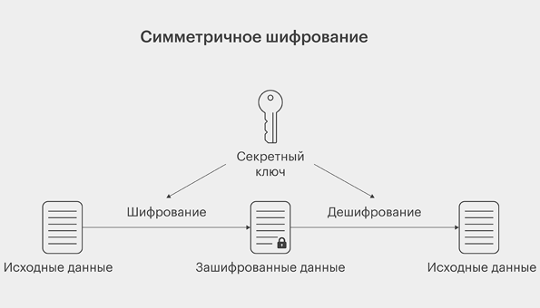
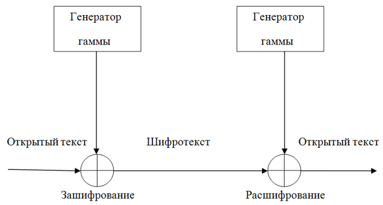
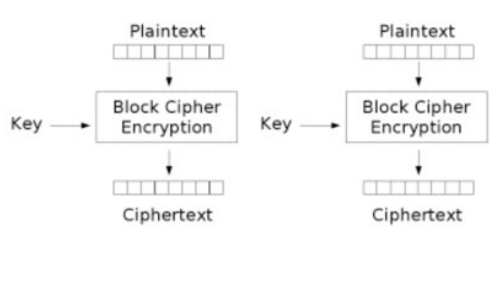
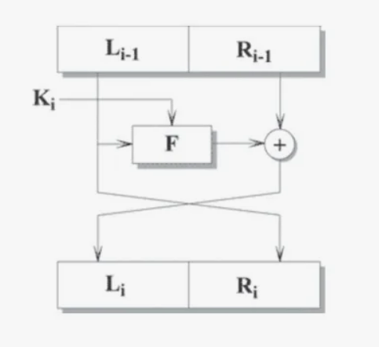

---
## Front matter
lang: ru-RU
title: Доклад
subtitle: Симметричные криптосистемы. Обзор, виды, применение.
author:
  - Иванов Сергей Владимирович, НПИбд-01-23
institute:
  - Российский университет дружбы народов, Москва, Россия
date: 30 апреля 2025

## i18n babel
babel-lang: russian
babel-otherlangs: english

## Formatting pdf
toc: false
slide_level: 2
aspectratio: 169
section-titles: true
theme: metropolis
header-includes:
 - \metroset{progressbar=frametitle,sectionpage=progressbar,numbering=fraction}
 - '\makeatletter'
 - '\beamer@ignorenonframefalse'
 - '\makeatother'

  ## Fonts
mainfont: PT Serif
romanfont: PT Serif
sansfont: PT Sans
monofont: PT Mono
mainfontoptions: Ligatures=TeX
romanfontoptions: Ligatures=TeX
sansfontoptions: Ligatures=TeX,Scale=MatchLowercase
monofontoptions: Scale=MatchLowercase,Scale=0.9
---

## Докладчик

  * Иванов Сергей Владимирович
  * Студент НПИбд-01-23
  * Российский университет дружбы народов
  * [1132236127@pfur.ru]

## Введение

:::::::::::::: {.columns align=center}
::: {.column width="50%"}
**Симметричное шифрование** — это метод защиты информации, при котором один и тот же ключ используется как для шифрования, так и для расшифровки данных. Основной принцип работы симметричных алгоритмов заключается в преобразовании открытого текста в зашифрованный с помощью криптографического ключа.
:::
::: {.column width="50%"}
{#fig:001 width=70%}
:::
::::::::::::::

## Преимущества симм. шифрования

-	Высокая скорость шифрования и дешифрования.
-	Низкая вычислительная нагрузка на устройство.
-	Простота реализации и стабильность алгоритмов.

## Недостатки симм. шифрования

-	Необходимость безопасного обмена ключом между сторонами.
-	Один ключ на пару участников — что неудобно при большом количестве пользователей.
-	Угрозы при перехвате ключа: весь обмен становится уязвимым.

**Слабое место** — обмен ключом. Т.к для работы алгоритма ключ должен быть и у отправителя, и у получателя сообщения, его необходимо передать; однако при передаче по незащищенным каналам его могут перехватить и использовать посторонние.

## Соответствие безопасности

:::::::::::::: {.columns align=center}
::: {.column width="50%"}
{#fig:002 width=70%}
:::
::: {.column width="50%"}
Большинство симметричных шифров для достижения результатов, соответствующих требованиям безопасности, используют комбинацию операций подстановки и перестановки, поочередно повторяя их. Один круг шифрования, состоящий из этих операций, называется раундом.
:::
::::::::::::::

## Виды СШ. Потоковое шифрование

:::::::::::::: {.columns align=center}
::: {.column width="50%"}
**Потоковое шифрование** — метод, при котором каждый бит сообщения шифруется с помощью соответствующего бита псевдослучайной последовательности, сформированной на основе ключа. Обычно применяется операция XOR: если биты совпадают — результат 0, если различаются — 1.

Примеры алгоритмов: RC4, SEAL, WAKE.
:::
::: {.column width="50%"}
{#fig:003 width=70%}
:::
::::::::::::::

## Блочное шифрование

:::::::::::::: {.columns align=center}
::: {.column width="50%"}
**Блочное шифрование** — способ защиты данных, при котором информация разбивается на блоки фиксированной длины (например, 64 или 128 бит). При нехватке данных для полного блока добавляются специальные символы-дополнения.

Примеры алгоритмов: AES, ГОСТ 28147-89, DES, 3DES, RC2.
:::
::: {.column width="50%"}
{#fig:004 width=70%}
:::
::::::::::::::

## Сеть Фейстеля

:::::::::::::: {.columns align=center}
::: {.column width="50%"}
{#fig:005 width=70%}
:::
::: {.column width="50%"}
**Сеть Фейстеля** — типовая структура симметричных шифров, использующая функцию F(D, K), где D — часть данных, K — ключ прохода. Функция F не обязана быть обратимой. Главное преимущество — одинаковая структура шифрования и дешифрования (различается лишь порядок ключей), что упрощает реализацию.
:::
::::::::::::::

## Применение

1. **Защита сетевого трафика** 

В протоколе TLS (Transport Layer Security) симметричное шифрование применяется после обмена ключами с использованием асимметричного алгоритма. Это позволяет обеспечить быструю и защищённую передачу данных в таких сервисах, как HTTPS, FTPS, SMTPS и других.

2. **VPN и защищённые каналы связи**

Протоколы VPN, такие как IPsec и OpenVPN, используют симметричные алгоритмы (например, AES) для создания защищённого туннеля между компьютерами. Это позволяет надёжно скрывать содержимое трафика от третьих лиц, даже если они имеют доступ к физической сети.

## Применение

3. **Шифрование файлов и накопителей**

Для защиты конфиденциальной информации, хранящейся на носителях, используются симметричные алгоритмы шифрования. Такие программы, как BitLocker, VeraCrypt, TrueCrypt, шифруют жёсткие диски или отдельные файлы с помощью AES или других блочных шифров, обеспечивая защиту данных даже в случае кражи устройства.

4. **Мобильные и десктопные приложения**

Многие современные приложения, например, мессенджеры и банковские клиенты используют симметричное шифрование для защиты локальных данных, кэша, токенов доступа или пользовательских секретов.

## Применение

5. **Обеспечение безопасности в беспроводных сетях**

В таких стандартах, как WPA2 и WPA3 (шифрование Wi-Fi), применяются симметричные алгоритмы для защиты передаваемой информации от перехвата и подмены.

6. **Смарт-карты, банковские карты, устройства с ограниченными ресурсами**

Симметричное шифрование часто используется в устройствах с ограниченными вычислительными возможностями — например, в смарт-картах, SIM-картах и встроенных микроконтроллерах, так как эти алгоритмы требуют меньше ресурсов по сравнению с асимметричными.

## Применение

7. **Электронная коммерция и финансовые транзакции**

При проведении операций в системах интернет-банкинга, терминалах оплаты и банкоматах часто применяются симметричные алгоритмы для защиты PIN-кодов, авторизационной информации и других данных.

## Вывод 

Симметричное шифрование — ключевой элемент защиты информации благодаря высокой скорости и простоте. Оно применяется в сетях, хранилищах данных, мобильных и банковских системах.

Несмотря на сложности с обменом ключами, оно остаётся незаменимым там, где важна производительность. В современных протоколах его часто сочетают с асимметричными методами для повышения безопасности.

## Список литературы

:::{#refs}
https://ru.ruwiki.ru/wiki/Симметричные_криптосистемы

https://habr.com/ru/companies/infotecs_official/articles/761008/

https://encyclopedia.kaspersky.ru/glossary/symmetric-encryption/?ysclid=m9wndtjhyv783519092

:::

